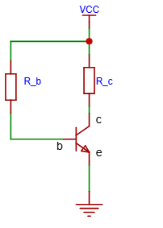
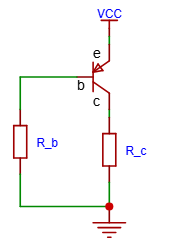
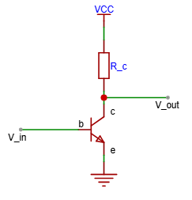
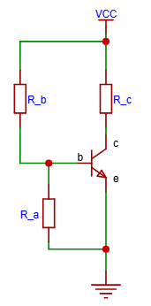
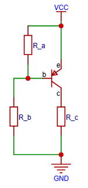

# 三极管

## NPN 三极管

一个基础的NPN三极管如下所示：

* e: 表示发射极
* b: 表示基极
* c: 表示集电极

当$V_{be} < 0.6V$（0.6V为二极管导通电压）时，$ce$不导通，当$V_{be} > 0.6V$导通时，$ce$导通。

### NPN三极管公式

* $I_e=I_c+I_b$
* $I_c=\beta I_b$ ($\beta$为三极管放大系数，一般为$100$)

### NPN三极管的三种状态

* 截止状态：发射结反偏，集电结反偏
* 放大状态：发射结正偏，集电结反偏
* 饱和状态：发射结正偏，集电结正偏

#### 截至状态

当$V_{be} < 0.6V$（0.6V为二极管导通电压）时，$I_b \approx 0$，所以$I_c=0$，$V_{R_c}=0 \times R_c = 0V$，$V_{ce}$压降$\approx V_{CC}$，三极管处于截止区，也就是$ce$不导通。

#### 放大状态

当$be$导通时，电流$I_c=\beta I_b$，由于$I_c$已知，所以$R_c$的压降为$V_{R_c}=I_c R_c$。假如$V_{R_c}+0.2V < V_{cc}$（$0.2V$为三极管$V_{ce}$钳位压降），此时三极管处于放大区。

#### 饱和状态

##### 饱和状态计算公式

1. 计算临界饱和的集电极电流$I_{c(sat)}$

    假设$V_{ce}$为$0$（或0.1V-0.2V，可以估算），则：$I_{c(sat) \approx \frac{V_{cc}}{R_c}}$

    * $V_{cc}$是集电极电压，$R_c$是集电极负载电阻

2. 计算临界饱和的基极电流$I_{b(sat,min)}$

    这是刚进入饱和时所需的最小基极电流。利用β：$I_{b(sat,min) = \frac{I_{c(sat)}}{\beta}}$

    * β取数据手册中的最小值，以保证设计可靠性。

3. 引入过驱动系数，判断是否深度饱和

    为了保证在温度变化、器件差异下都可靠饱和，会刻意将基极电流设计得更大。这个“设计过驱动倍数”即过驱动系数 (Overdrive Factor, ODF)。一般取 2到10。

    $I_{b(design)}=ODF \times I_{b(sat,min)}$

    判断标准： 只要你设计的实际基极电流$I_b \geq I_{b(design)}$ ，三极管就一定进入饱和状态。

当$be$导通时，假如$\beta \times I_b > I_c$，三极管处于饱和区。此时$I_c$不能通过$I_c=\beta I_b$计算，计算正确的$I_c$需要公式：$I_c= \frac{V_{cc}-V_{ce(sat)}}{R_c}$。

这里需要注意：**三极管处于饱和状态时，$V_{ce}$压降会被钳位在$0.2V$，也就是说$V_c-V_e$总是$\approx$$0.2V$，此时$V_{R_c}$会承受更多电压**，这也是负载$R_c$的意义，如果没有$R_c$电阻，这个电压会被施加到导线或者电源内阻，导线会短路，$I_c$瞬间飙升，最终导致电子元件被烧毁。

假设$V_{cc}=5V$，$R_c=1k\Omega$，带入公式：$I_c= \frac{5V-0.2V}{1k\Omega}=4.8mA$。

## PNP三极管

PNP三极管与NPN三极管相似，如下所示：

基极电流$I_b$：从$e$流入，从$b$流出到地。
集电极电流$I_c$：从$e$流入，从$c$流出到负载。

### PNP三极管公式

**PNP三极管的公式与NPN相同**。

### PNP三极管的三种状态

* 截止状态：发射结反偏($V_{eb} < 0.6V$)，集电结反偏。
* 放大状态：发射结正偏 ($V_{eb} \approx 0.7V$)，集电结反偏。
* 饱和状态：发射结正偏，集电结正偏。

## 三极管反相功能

当三极管工作在放大区时，三极管拥有反相功能。

* $V_{in}$输入**高电平**时，$V_{out}$输出**低电平**。
* $V_{in}$输入**低电平**时，$V_{out}$输出**高电平**。

假设为$V_{in}$输入一个低电压，此时$be$断路，所以$ce$也短路，$V_{out}$为高电压（$R_c$后级电路）。假设为$V_{in}$输入一个高电压，根据$I_c=\beta I_b$得出$I_c$升高，所以$R_c$的电压升高，$V_{out}$分得的电压变小，为低电平。

## 三极管基极下拉电阻

为NPN三极管增加下拉电阻可以改善噪声干扰。如下图所示，$R_a$是用于改善噪声的电阻：

## 三极管基极上拉电阻

与NPN三极管相对应，**PNP三极管**想要改善干扰需要加上拉电阻，$R_a$是用于改善噪声的电阻：

## 三极管反向耐压

三极管**反向电压**不能超过他的最大反向耐压值，否则很容易击穿。因为反向耐压一般很小，所以一定要注意。$V_{be}$反向耐压一般为$6V$。
