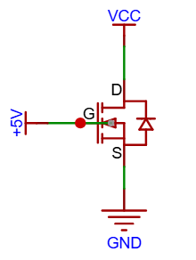
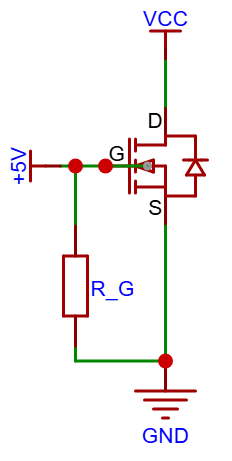

# MOS管

## NMOS管

一个基础的NPN MOS管电路如下所示：

* D 表示漏极
* G 表示栅极
* S 表示源极

当$V_G-V_S>V_{th}(阈值电压)$，$DS$导通。

### NMOS管寄生电容

当$V_{GS}$导通后，$GS$相当于一个电容充电，这被称为寄生电容。一旦$V_{GS}$被充电到$V_{GS(th)}$（阈值电压）以上，沟道已经形成，此时若去掉栅极电源，并且$GS$不放电，$DS$依然会导通。

**绝对不能让栅极处于悬空状态**：实践时，必须增加下拉电阻强制放电，即使不放电，也会因为漏电流导致逐渐关断。

如下所示，$R_G$是下拉电阻：

### NMOS管寄生二极管

$GS$之间会有一个内部的二极管，称为寄生二极管或者体二极管，这是由于内部结构导致的。**设计时不能忽略寄生二极管，要防止电流倒灌**

### NMOS管作为开关时的注意事项

当NMOS作为开关饱和导通后，$DS通路$相当于一个电阻，也就是$R_{DS(on)}$**（通态漏源电阻）**。由于欧姆定律，电阻的后级电路分到的电压会变小。

假设用 NMOS 驱动一个2A的灯泡，选用的MOS管$R_{DS(on)}=0.05 \Omega$

* 产生的压降：$2A \times 0.05 \Omega=0.1V$
* 如果电源是 5V，灯泡实际只得到了 4.9V。这 0.1V 就被NMOS吃掉了。

MOS管迟到的电压和电流成正比，电流越大，吃掉的电压就越多。

#### 如何减少被吃掉的电压

方法1. $V_{GS}$必须远大于$V_{DS}$与阈值电压之和，才能保证MOS管彻底导通，呈现极小的$R_{DS(on)}$。

方法2. 电容自举：$GS$通路直连，不要添加其他负载，使$V_{GS}$保持最大电压。

方法3. 使用PMOS替代,PMOS天然适合做开关。

### 什么时候选NMOS

在一些频率较高，电流较大的场景，优先使用NMOS

## PMOS放反接电路

## MOS管$DS$之间电流可以双向导通

如果想让MOS管只能单向导通，可以再加入一个同类型MOS管，$D$极靠在一起，抵消寄生二极管。

## MOS管导通电流与$V_{GS}$关系

MOS管的导通电流与$V_{GS}$成正比，大部分MOS管当$V_{GS}大于$4.5V$时，进入饱和状态。

## MOS管最大耐压

所有MOS管都有最大耐压值。

## ESD 静电保护电路
