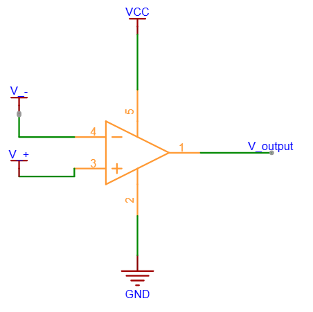

# 比较器

一个基础的比较器如下所示：

* 当$V_+>V_-$时，比较器输出高电平。
* 当$V_+<V_-$时，比较器输出低电平。

## 使用比较器注意事项

比较器的输出结构主要分为OD（开漏）、OC（开集）、推挽输出三种结构，其中OD和OC需要加上拉电阻，推挽输出不需要加上拉电阻。一般将$V_{output}$与$V_{cc}$连接，实际设计时应该参考数据手册。

OC：输出结构为三极管，输出电路连接到集电极。所以称为开集。
OD：输出结构为MOS管，输出电路连接到漏极。所以称为开漏。

### 上拉电阻的作用：提供确定的高电平通路

* 开关断开时：VCC 通过 R 将输出端拉到高电平 → 确定的高电平

* 开关导通时：输出端通过开关直接拉到 GND → 低电平。此时 VCC → R → GND 形成一个通路，有电流流过 R，但输出是确定的低电平。

### 对于OD输出，上拉电阻的作用一般是解决寄生电容和充电速度问题

上拉电阻越小，电流越大，充电速度越快。

选择电阻时，首先要满足信号的传输速度。电阻越小，传输速度也就越快。但是电流不能超过比较器的开关最大吸收电流。

## 比较器的输入范围

比较器的输入范围不能超过供电器的供电范围，超过芯片供电范围可能会工作异常。

## 比较器的震颤问题

解决方法：将$V_+$有$V_{out}$之间增加一个电阻。
