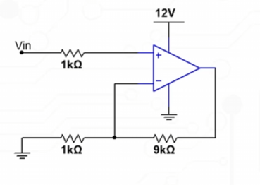
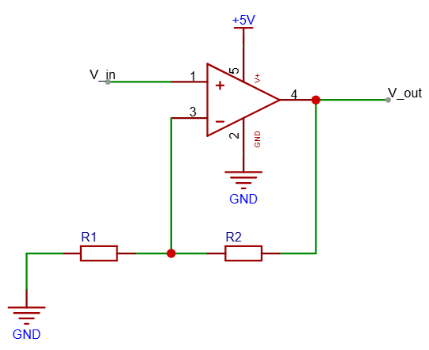
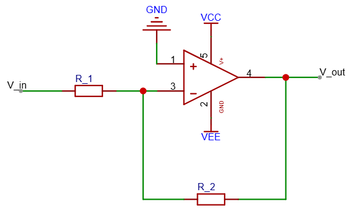
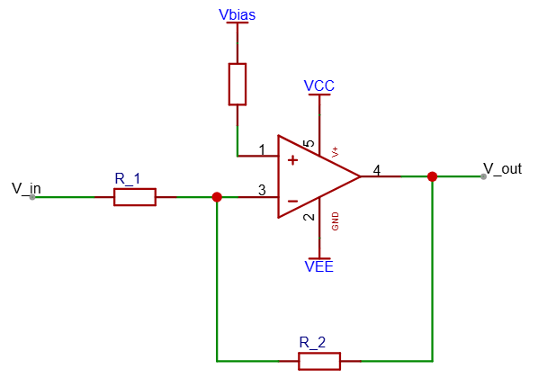
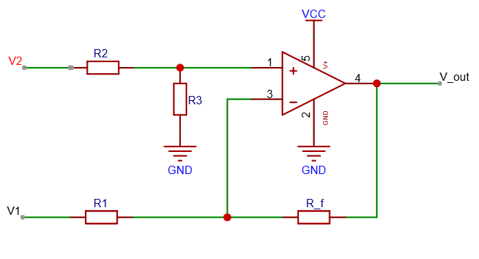
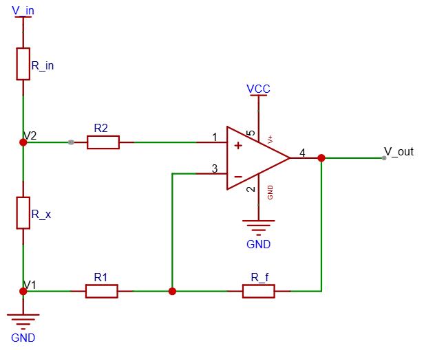
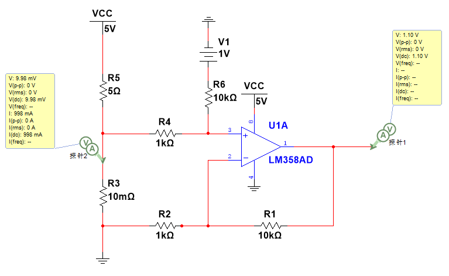
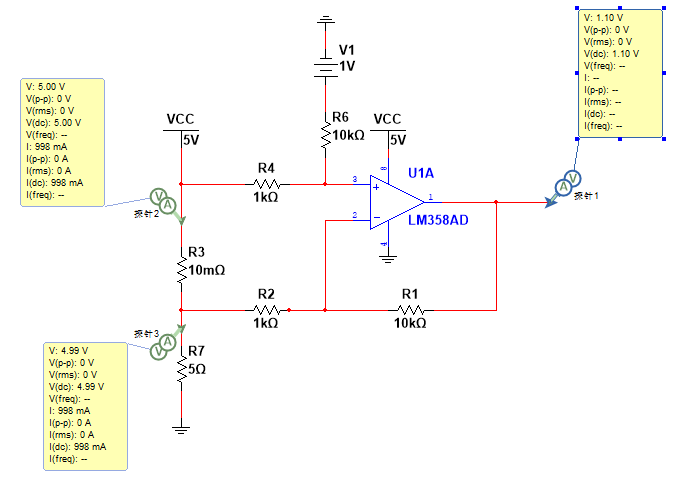

# 运算放大器

常用作信号处理。如：信号放大、滤波、微分、积分、整流等。

## 虚断和虚短

**虚短和虚断的意思是，虽然输入端连接着信号，但因为输入阻抗极大（像个极大的电阻），导致电流几乎流不进去 (虚断)；又因为电流几乎为零，两个输入端之间的电压差也几乎为零，就像被一根导线短路了一样 (虚短)。**

虽然输入阻抗极大，并且几乎没有电流，但是输入端的信号依然能反映到输出端。

虚短是指在运放正常工作过程中，其$V_+=V_-$

* 从数学公式上解释：$V_{out}=(V_++V_-) \times GAIN_{开环}$
  
* 从物理本质上解释：

  当运放$V_+>V_-$时，输出$V_{out}$上升

  当运放$V_+<V_-$时，输出$V_{out}$下降

  

### 深度负反馈电路

如果没有深度负反馈电路，那么运放只是一个比较器，只有加入深度负反馈电路，虚短和虚断才成立。

* 没有深度负反馈电路：只有虚断
* 加入深度负反馈电路：虚短成立

## 同相放大电路

公式：$V_{out}=V_{in} \times (1 + \frac{R_2}{R_1})$

## 反相放大电路

公式：$V_{out}=V_{in} \times -(\frac{R_2}{R_1})$

## 单电源反相放大电路

比反相放大电路多了一个电源$V_{bias}$，使$V_{out}$的最低电压等于$V_{bias}$。

公式：$V_{out}=V_{bias} - (\frac{R_2}{R_1}) \times (V_{in}-V_{bias})$

## 差分放大电路

公式：$V_{out}=V_2(\frac{R_3}{R_1})(\frac{R_1+R_f}{R_2+R_3})-V_1\frac{R_f}{R_1}$

For $R_2=R_1$ and $R_3=R_f$, $V_{out}=\frac{R_f}{R_1}(V_1-V_2)$

## 低端电流检测电路

$I_{in}=\frac{V_{in}}{R_{in}}$

$V_{out}=I_{in} \times R_x \times \frac{R_f}{R_1}$

注意：$R_2=R_1$

这样$V_{out}$就可以检测输入电流了。

### 低端电流检测电路注意事项

* 运放的输入输出范围
* 运放的$V_{os}$对输出的影响

带偏置电流的低端电流检测电路：

$V_{out}=I_{in} \times R_x \times \frac{R_f}{R_1} + V_{ref}$

## 高端电流检测电路

**与低端电流检测电路几乎相同，只不过负载加载采样电阻下方。**

