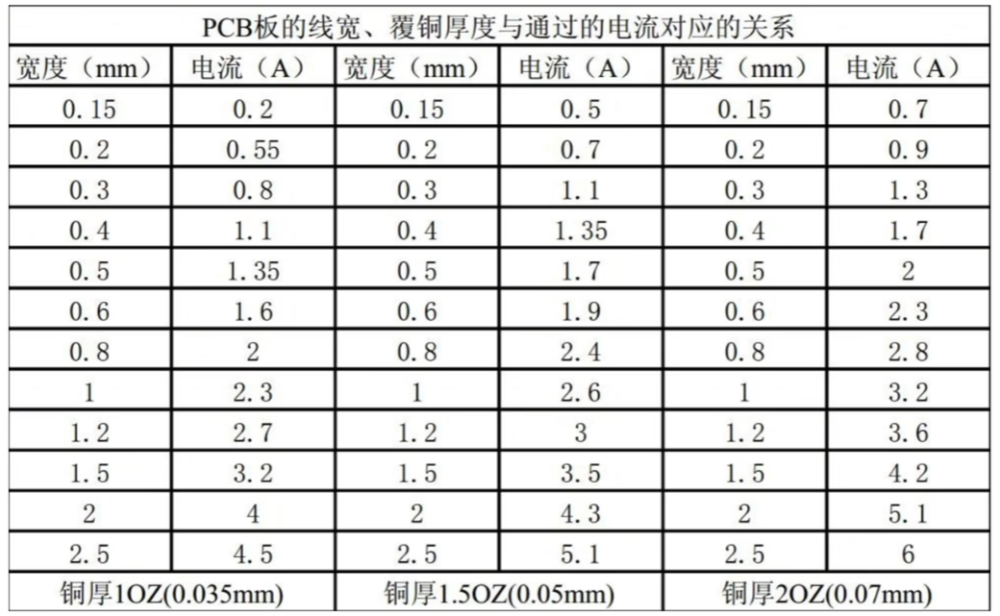
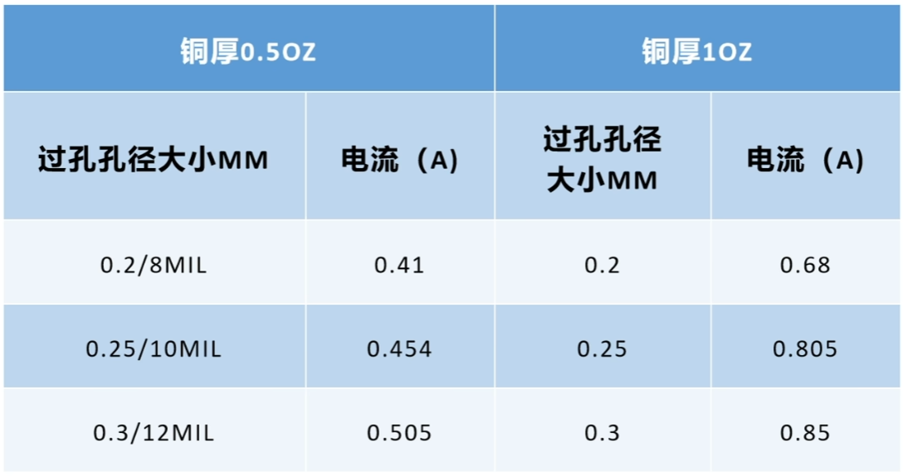

# 高速PCB设计

## xc7 芯片参考手册

### 核心手册概览

| 手册编号 | 手册名称 | 核心内容与用途 |
| :--- | :--- | :--- |
| UG470 | 配置指南 (Config) | 芯片上电后的加载、启动模式、JTAG编程等流程 |
| UG471 | SelectIO 资源 | I/O电平标准、管脚特性、高速IO（Bank相关详细信息） |
| UG472 | 时钟资源 (Clocking) | 芯片内部时钟架构、MMCM/PLL、时钟网络设计（如PCIe的100MHz参考时钟） |
| UG473 | 存储资源 (Memory) | Block RAM、分布式RAM等片上存储资源的使用 |
| UG474 | 可配置逻辑块 (CLB) | 芯片逻辑的基本单元Slice/LUT、触发器的结构和用法 |
| UG479 | DSP48E1 资源 | 高性能数字信号处理专用单元，用于复杂数学运算 |
| UG480 | XADC 模数转换器 | 芯片内置的温度、电压监控模块，用于电源设计验证和系统监控 |
| UG482 | GTP 收发器 | GTP高速串行收发器的详细手册，PCIe物理层的根基 |
| UG475 | 封装与管脚规格 | 硬件设计必备，提供封装尺寸、物理引脚详细定义和BANK划分 |
| UG477 | PCI Express 集成块 | 专门讲7系列内置的PCIe硬核IP，包括配置、使用和AXI接口 |
| UG483 | PCB设计与管脚规划 | 电源分配、去耦策略、高速信号布线 |
| UG586 | 存储接口方案 (MIG) | 用于连接DDR3内存（如项目里FPGA板载的1GB内存） |

### 高速PCB设计原则

高速PCB设计推荐手册：UG483 + UG475 + UG482 + UG477

### 信号完整性

#### 收发交叉连接：FPGA的TX必须连到金手指的RX；FPGA的RX必须连到金手指的TX

  ```text
  对于 PCIe：

  Root Complex 的 TX → Endpoint 的 RX
  Endpoint 的 TX → Root Complex 的 RX

  也就是：

  FPGA GTP_TXP/N → PCIe_RXP/N
  FPGA GTP_RXP/N ← PCIe_TXP/N

  标准全双工 SerDes 连接。
  ```

#### AC耦合电容：必须在发送端（FPGA的TX方向）串联 0.1µF 或 0.22µF 的电容。电容要尽量靠近发送端引脚，用来隔除直流偏置

* PCIe规范推荐

    通常：
      75nF ~ 265nF 都可以
      工程里最常见：
      0.1uF
      0.22uF

    PCIe Gen1/2：
      0.1uF 最常见

    PCIe Gen3/4：
      0.22uF 更常见

* AC耦合电容只放一侧

  不能两边都放。

  一般：

  * 放在 TX 端

  * 靠近 TX

#### 等长与差分阻抗

* 严格保持 100Ω±10% 差分阻抗。
* 差分对的两条线长度必须控制在规范范围内。
* 多通道（如x4）设计时，所有通道的走线长度也要匹配，避免产生过大时延。

#### 多Lane匹配

* 多lane之间控制时延偏差
* 避免某lane过长
* 尽量保持拓扑一致

#### 参考地完整性

* 差分线下方必须保持连续参考地
* 避免跨plane split
* 避免跨地缝
* 减少回流路径中断
* 地层尽量不要走线，地层最好有完整参考平面

#### REFCLK布局

* REFCLK必须使用低抖动差分时钟
* 避免靠近DC-DC
* 避免靠近DDR
* 尽量短且对称

#### GTP模拟电源

* MGTAVCC/MGTAVTT使用独立低噪声LDO
* 去耦电容紧贴管脚
* 电源回路面积最小
* 避免数字电源噪声耦合

#### Via(过孔)与层切换

* 尽量减少Via
* 避免长stub
* 高速链路优先单层直走
* Gen3+建议考虑backdrill
  
#### 数字远离模拟，高速优先靠近接口

* 高速信号区：板子上速度最快、对噪声最敏感的地方。
* 敏感模拟区：FPGA的GTP Bank（Bank 216）及其供电电路（MGTAVCC/VTT）。这是模拟信号区块，任何数字噪声都不能过来。
  * REFCLK 极其敏感：
    * 差分
    * 低抖动
    * 不穿分割
    * 不靠DC-DC
* 数字核心及接口区：FPGA核心供电、普通IO（Bank 13/14）、CH347调试接口、DDR内存等。
* 电源区：所有DC-DC转换器、LDO，特别是给GTP Bank供电的那路独立LDO，务必把它放在靠近Bank 216的地方。

#### 高速信号线背面不能走线

不建议在PCIe等高速信号线的正背面平行走线，但可以走那些与它无关的低速信号。

最好正背面铺GND，或者换到内层走带状线。

#### 3W原则

两条走线中心到中心的间距，必须大于等于3倍线宽（即中心距 ≥ 3W）

#### 20H原则

将电源层（Power Plane）的边缘，相对于其相邻的地层（0V/GND Plane）边缘向内缩进一段距离。这段距离等于电源层与地层之间介质厚度（称为H）的20倍。

主要是为了抑制一种叫做边缘辐射的电磁干扰（EMI）。

实际应用中，通常将电源层比地层内缩 0.5mm ~ 1mm（即约20mil ~ 40mil），**优先40mil**。

#### 回流地过孔

地过孔是**单端信号**和**共模噪声**的共同回路。**单端信号**和**共模噪声**会使用。

**差分信号**换层时，旁边必须有地过孔：

* 单面直连优先 从源头免掉麻烦。根本不打孔，它们就一直在顶层跑，不存在这个换地平面的问题。

* 必须换层时，强制加回流地孔。每打一个高速信号孔，必须紧挨着打同规格的地孔。信号连着第1层和第3层，地孔就连第2层和第4层。差分对两条线出来时，孔两侧各放一个地孔，保证对称。

高速信号换层的时候，必须同时、紧挨着信号孔打下专门给信号返回电流走的接地过孔。

注意：必须在旁边打孔，为了物理上强制返回电流走最短路径，从而把不可控的大环路，框在最小的范围里。

#### 高速线包地

虽然大部分场景由于线路密集可能无法包地，但是能包就包。

#### 布线不能有直角

布线时不允许有直角，圆角最佳，其次45°角。

#### 同组同层

差分信号线保证同组同层

### 电源完整性

#### 分配专用层

为**电源层**和**地层**分配专用层。这就是为什么2层板比4层板电磁干扰更小的原因。

#### 电源层分割

合理划分不同电源的布线区域。不要跨区域布线，比如3.3V和5V混在一起。避免**电源交叉污染**以及**参考平面被破坏**。

需要考虑电源过孔数量，多大的电源就要有多少过孔，以及过孔的载流能力。

信号走线不能跨电源分割。

#### 开关电源布局

* 电源找到主干道，注意回流路径，原则是越短越好。
* 摆放器件时，布局要紧凑。使电源路径尽量短，并且注意流出打孔和铺铜的空间。
* 滤波电容在电源路径保持先大后小的原则。
* 对于输出多路的开关电源尽量使相邻电感之间垂直放置，大电感和大电容尽量布置在主器件面。
* 电源输入/输出路径布线采用铺铜处理，铺铜宽度必须满足电源电流大小。输入/输出路径尽量少打孔换层，打孔换层的位置须考虑滤波器件位置，输入应打孔在滤波器件之前，输出在滤波器件之后。
* 反馈路径需要远离干扰源和大电流的平面上，一般采用10mil以上的线连到输出滤波电容之后。
* 开关电源模块内部的信号互联线尽量短而粗，一般加粗到10mil以上（但不能比焊盘粗）。
* 开关电源模块的电感器件底下需避免走线，其所在层需挖空铜皮处理（挖空至丝印位置），电感附近如有走线，需要对信号线包地处理，防止造成电磁干扰（EMI）。

* 电流与线宽关系如下，设计时应保留余量：

  

* 电流与过孔关系如下，设计师应保留余量：
  

### 时钟选择

1. 使用PCIe金手指的参考时钟（主板提供）
2. 板载独立晶振

## 布局原则

### HDMI布局原则

* 差分信号阻抗100Ω，单端信号阻抗50欧。
* ESD器件要靠近HDMI端子放置。
* 四对差分走线对内误差$< 5mil$，组内间距误差$< 10mil$，对其他信号线保持$15mil$间距，以便减小串扰。
* 邻近GND层走线，空间足够的情况下包地处理。
* 差分信号线尽量不要换层，如果换层必须打上回流地过孔。

### DDR布局原则

* DDR模块应靠近CPU。
* 1片DDR时，使用点对点布局方式（一个CPU对应一个DDR）。
* DDR*2片时，相对于CPU严格对称（每颗DDR颗粒的信号路径要完全等长，常见有Fly-by T型拓扑；正反对贴/Clam-shell拓扑）；

  间距推荐（DDR到CPU推荐的中心距离）：无排阻时：900-1000mil；有排阻时：1000-1300mil。
* DDR滤波电容靠近DDR管脚放置。
* 端接匹配电阻摆放：串联端接电阻放置到CPU端，并联端接电阻放置到DDR端。
* 地址线、控制线、时钟线是单向传输，且一般都是点到多点的拓扑结构。多个DDR间使用远端分支，分支尽量短且等长，并联电阻放在DDR端第一个T点处，长度不超过500mil；走菊花链拓扑的，并联电阻放在最后一个DDR后面，长度不超过500mil。
* Vref电容的放置要注意要靠近芯片的Vref管脚；走线要粗短，减少线上的电感。

### DCDC电源布局原则

* 找到电流主干道，注意回流路径，原则是越短越好。
* 摆放器件时，器件布局尽量紧凑，使电源路径尽量短，且注意留出打孔和铺铜的空间，以满足电源模块输入/输出通道通流能力。
* 注意滤波电容位置，滤波电容在电源路径上保持先大后小原则。
* 对于输出多路的开关电源尽量使相邻电感之间垂直放置，大电感和大电容尽量布置在主器件面。
* 把体积最小、容值最小的高频陶瓷电容贴在芯片输出引脚的同一层（正面），这是硬性要求。大电容如果实在放不下，可以通过多过孔并联的方式放在背面，但要清楚这会对高频滤波性能有轻微损失。

## 布线原则

### DDR3 布线原则

* 信号线进行分类。
* 数据线、地址（控制）线、时钟线之间的距离保持20mil以上或至少3W。
* 完整的参考平面，VREF电源走线推荐>=20~30mil
* 布线时不允许有直角，布线时要保证线上的Stub短；要对所有的线进行阻抗控制，保证传输线的阻抗连续。
* 等长要求：差分对误差严格控制在5mil。数据线同组(DQS、DM、DQ[7:0])组内等长范围为±10mil；地址线、控制线、时钟线误差范围控制在±25mil。

### DCDC电源布线原则

* 电源输入/输出路径布线采用铺铜处理，铺铜宽度必须满足电源电流大小，输入/输出路径尽量少打孔换层，打孔换层的位置须考虑滤波器件位置，输入应打孔在滤波器件之前，输出应打孔在滤波器件之后。
* 反馈路径需要远离干扰源和大电流的平面上，一般采用10mil以上的线连到输出滤波电容之后。
* 开关电源模块内部的信号互联线尽量短而粗，一般加粗到10mil以上（但不能比焊盘粗）。
* 开关电源模块的电感器件底下需避免走线，其所在层需挖空铜皮处理（挖空至丝印位置），电感附近如有走线，需要对信号线包地理，避免造成电磁干扰（EMI)，这种干扰可能会导致信号质量下降。

### 多层板如何叠层

根据单板电源、地的种类、信号密度、板级工作频率、有特殊布线要求的信号数量和生产成本综合考虑。

### 传输线与阻抗的关系

[嘉立创PCB工艺能力范围](https://www.jlc.com/portal/vtechnology.html)

[嘉立创阻抗计算器](https://tools.jlc.com/jlcTools/index.html#/impedanceCalculatenew)

$Z_0=\sqrt{\frac{R+j \omega L}{G+j \omega C}}$

实际应用中，传输线的电阻部分，即耗能部分往往可以忽略不计，即无损情况下上式中的$R$和$G$为$0$：

$Z_0=\sqrt{\frac{L}{C}}$

#### 不控阻抗的影响

* 信号反射
* 信号衰减

#### 特性阻抗几种类型

1. 差分阻抗：
   * 差模阻抗
   * 公模阻抗

### 设计步骤

1. 模块化布局：将原件按自身作用布局。
   * 先放大元件，再放小元件。
   * 相同模块靠近，避免走线过长导致信号错误。
   * BGA扇孔和BGA滤波电容摆放。
2. 阻抗和阻抗规则：确定元件之间的阻抗规则，并在EDA软件中设置。
   * 电源走线规则
   * 差分对走线规则
3. 扇孔和布线
4. 时序等长
