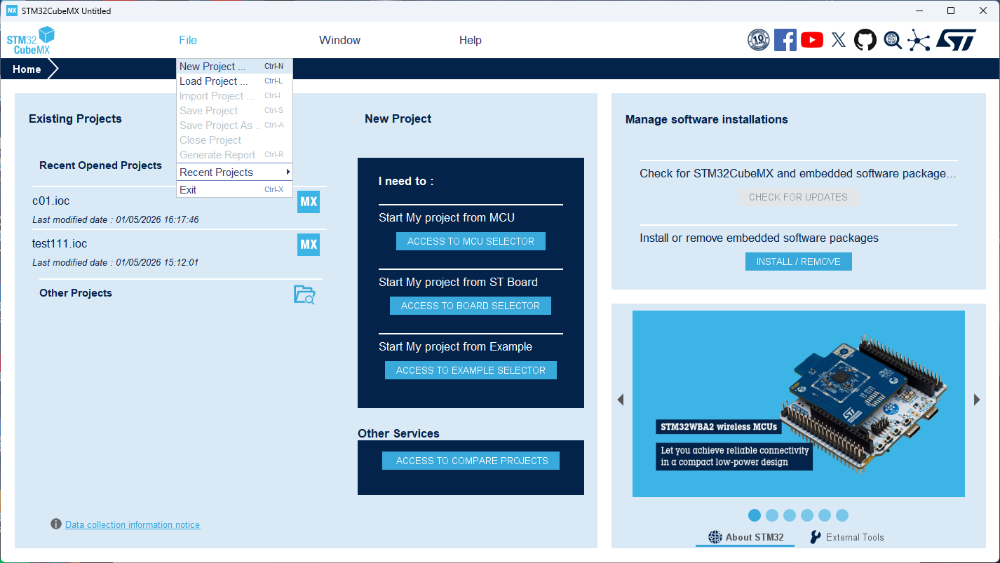
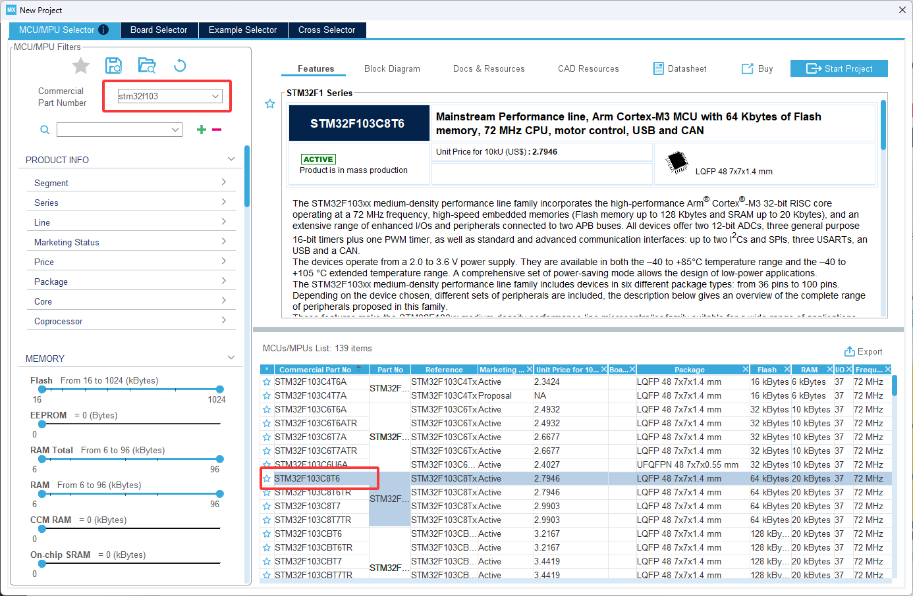
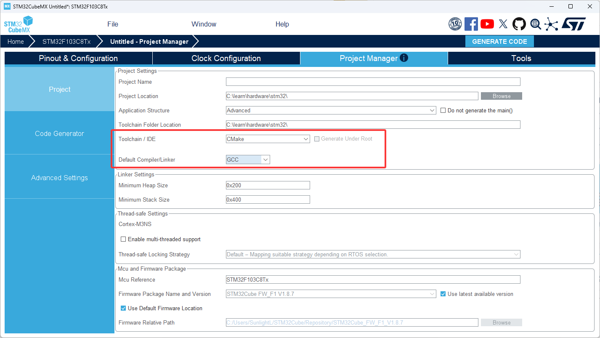
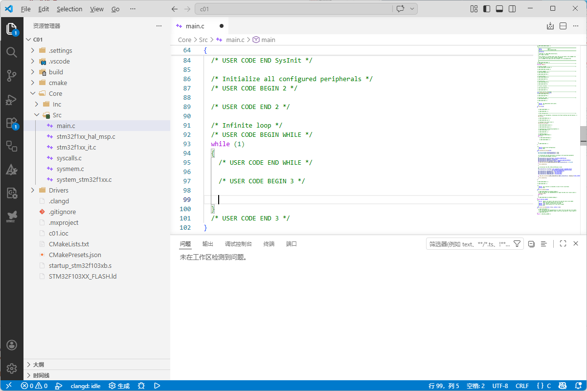

# 使用VSCODE+CMAKE开发STM32

## 安装 StCubeMX

[下载地址（需要登陆）](https://www.st.com.cn/zh/development-tools/stm32cubemx.html)

## 使用 StCubeMX 创建项目

### 1. New Project

   

### 2. 选择芯片型号

   点击 **Start Project** 进入配置界面

  

### 3. 生成代码

1. 点击 **Project Manager**

2. **ToolChain** 选择 **CMake**

3. **Compiler** 选择 **GCC**

4. 点击 **Generate Code** 生成代码



## 使用 VSCode 打开生成的项目

源文件在 **Core/Inc/main.c**



## LED 点灯实验

```c
int main(void) {
  /* MCU Configuration--------------------------------------------------------*/
  /* Reset of all peripherals, Initializes the Flash interface and the Systick. */
  HAL_Init();

  /* Configure the system clock */
  SystemClock_Config();

  /* Initialize all configured peripherals */
  // MX_GPIO_Init();

  // 开始GPIOC时钟
  __HAL_RCC_GPIOC_CLK_ENABLE();

  GPIO_InitTypeDef GPIO_InitType = {0};
  GPIO_InitType.Pin = GPIO_PIN_13;
  // 推挽输出
  GPIO_InitType.Mode = GPIO_MODE_OUTPUT_PP;
  // GpioInitType.Pull = GPIO_NOPULL;
  GPIO_InitType.Speed = GPIO_SPEED_LOW;
  HAL_GPIO_Init(GPIOC, &GPIO_InitType);

  while (1)
  {
    // LED 开启
    HAL_GPIO_WritePin(GPIOC, GPIO_PIN_13, GPIO_PIN_RESET);

    HAL_Delay(50);
    
    // LED 关闭
    HAL_GPIO_WritePin(GPIOC, GPIO_PIN_13, GPIO_PIN_SET);

    HAL_Delay(50);
  }
}
```

## 按钮开关灯实验

```c
int main(void) {
  /* MCU Configuration--------------------------------------------------------*/
  /* Reset of all peripherals, Initializes the Flash interface and the Systick. */
  HAL_Init();

  /* Configure the system clock */
  SystemClock_Config();

  /* Initialize all configured peripherals */
  // MX_GPIO_Init();

  __HAL_RCC_GPIOA_CLK_ENABLE();
  __HAL_RCC_GPIOC_CLK_ENABLE();

  GPIO_InitTypeDef GPIO_InitType = {0};
  GPIO_InitType.Pin = GPIO_PIN_0;
  GPIO_InitType.Mode = GPIO_MODE_OUTPUT_PP;
  // GpioInitType.Pull = GPIO_NOPULL;
  GPIO_InitType.Speed = GPIO_SPEED_LOW;
  HAL_GPIO_Init(GPIOA, &GPIO_InitType);

  GPIO_InitTypeDef GPIO_InitType_A1 = {0};
  GPIO_InitType_A1.Pin = GPIO_PIN_1;
  GPIO_InitType_A1.Mode = GPIO_MODE_INPUT;
  GPIO_InitType_A1.Pull = GPIO_PULLUP;
  HAL_GPIO_Init(GPIOA, &GPIO_InitType_A1);

  HAL_GPIO_WritePin(GPIOA, GPIO_PIN_0, GPIO_PIN_RESET);

  while (1) {
    GPIO_PinState Pin0State = HAL_GPIO_ReadPin(GPIOA, GPIO_PIN_1);
    if (Pin0State == GPIO_PIN_RESET) {
      HAL_GPIO_WritePin(GPIOA, GPIO_PIN_0, GPIO_PIN_SET);
    } else {
      HAL_GPIO_WritePin(GPIOA, GPIO_PIN_0, GPIO_PIN_RESET);
    }
  }
}
```

## 串口输出实验

```c
int main(void)
{
  /* MCU Configuration--------------------------------------------------------*/

  /* Reset of all peripherals, Initializes the Flash interface and the Systick. */
  HAL_Init();

  /* Configure the system clock */
  SystemClock_Config();

  __HAL_RCC_GPIOB_CLK_ENABLE();
  __HAL_RCC_AFIO_CLK_ENABLE();

  // 开启重映射
  __HAL_AFIO_REMAP_USART1_ENABLE();

  /* Initialize all configured peripherals */
  MX_GPIO_Init();
  MX_USART1_UART_Init();


  //
  // PB6: Tx
  // PB6: Rx
  //
  GPIO_InitTypeDef GPIOB6_InitType = {0};
  GPIOB6_InitType.Pin = GPIO_PIN_6;
  GPIOB6_InitType.Mode = GPIO_MODE_AF_PP;
  // GpioInitType.Pull = GPIO_NOPULL;
  GPIOB6_InitType.Speed = GPIO_SPEED_LOW;
  HAL_GPIO_Init(GPIOB, &GPIOB6_InitType);

  GPIO_InitTypeDef GPIOB7_InitType = {0};
  GPIOB7_InitType.Pin = GPIO_PIN_7;
  GPIOB7_InitType.Mode = GPIO_MODE_INPUT;
  GPIOB7_InitType.Pull = GPIO_PULLUP;
  GPIOB7_InitType.Speed = GPIO_SPEED_LOW;
  HAL_GPIO_Init(GPIOB, &GPIOB7_InitType);

  HAL_UART_StateTypeDef UART1_State = HAL_UART_GetState(&huart1);
  if (UART1_State == HAL_UART_STATE_READY) {
    uint8_t data[] = "12345";
    HAL_StatusTypeDef TxStatus = HAL_UART_Transmit(&huart1, data, sizeof(data), 20);
    assert_param (TxStatus == HAL_OK);
  }

  /* Infinite loop */
  while (1)
  {
    
  }
}
```

## 串口接收数据

```c
int main(void)
{
  /* MCU Configuration--------------------------------------------------------*/

  /* Reset of all peripherals, Initializes the Flash interface and the Systick. */
  HAL_Init();

  /* Configure the system clock */
  SystemClock_Config();

  __HAL_RCC_GPIOB_CLK_ENABLE();
  __HAL_RCC_GPIOC_CLK_ENABLE();
  __HAL_RCC_AFIO_CLK_ENABLE();

  __HAL_AFIO_REMAP_USART1_ENABLE();

  /* Initialize all configured peripherals */
  MX_GPIO_Init();
  MX_USART1_UART_Init();

  GPIO_InitTypeDef GPIOB6_InitType = {0};
  GPIOB6_InitType.Pin = GPIO_PIN_6;
  GPIOB6_InitType.Mode = GPIO_MODE_AF_PP;
  // GpioInitType.Pull = GPIO_NOPULL;
  GPIOB6_InitType.Speed = GPIO_SPEED_HIGH;
  HAL_GPIO_Init(GPIOB, &GPIOB6_InitType);

  GPIO_InitTypeDef GPIOB7_InitType = {0};
  GPIOB7_InitType.Pin = GPIO_PIN_7;
  GPIOB7_InitType.Mode = GPIO_MODE_INPUT;
  GPIOB7_InitType.Pull = GPIO_PULLUP;
  GPIOB7_InitType.Speed = GPIO_SPEED_HIGH;
  HAL_GPIO_Init(GPIOB, &GPIOB7_InitType);

  GPIO_InitTypeDef GPIO_InitType = {0};
  GPIO_InitType.Pin = GPIO_PIN_13;
  GPIO_InitType.Mode = GPIO_MODE_OUTPUT_PP;
  // GpioInitType.Pull = GPIO_NOPULL;
  GPIO_InitType.Speed = GPIO_SPEED_LOW;
  HAL_GPIO_Init(GPIOC, &GPIO_InitType);
  
  HAL_GPIO_WritePin(GPIOC, GPIO_PIN_13, GPIO_PIN_SET);

  uint8_t revc_data[32] = {0};

  /* Infinite loop */
  while (1)
  {
    memset(revc_data, 0, 32);

    HAL_StatusTypeDef RecvStatus = HAL_UART_Receive(&huart1, revc_data, 1, 10);

    if (RecvStatus != HAL_OK) {
      continue;
    }

    if (revc_data[0] == '1') {
      HAL_GPIO_WritePin(GPIOC, GPIO_PIN_13, GPIO_PIN_RESET);
    } else if (revc_data[0] == '0') {
      HAL_GPIO_WritePin(GPIOC, GPIO_PIN_13, GPIO_PIN_SET);
    }
  }
}
```
