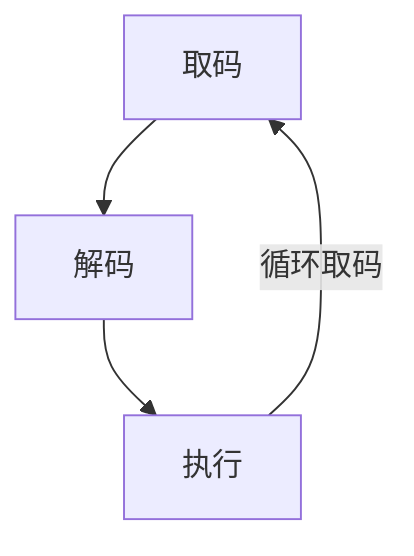

# VMP分析 0x0：虚拟机壳基本概念

## 虚拟机壳

以Java虚拟机（JVM）为例，其工作流程分为两步：首先，编译器（javac）将源代码编译成平台无关的Class字节码；随后，JVM实例在运行时加载这些字节码，并通过其解释器逐条将其转换为机器码来执行。

虚拟机壳的流程与JVM类似，只不过它的编译原料不是源代码，而是可执行文件（如.exe）中已有的二进制机器码。它会将这些机器码重新编译成一套自定义的私有指令（字节码），然后交由内置的虚拟机在运行时解释执行。

这显著提升了逆向工程的难度，逆向人员面对的不再是CPU可直接执行的原始指令流，而是由虚拟机自定义的一套私有指令集。由于这套指令与底层硬件架构完全脱耦，静态分析时几乎无法还原原始程序的控制流与数据流，逆向者必须在理解这套自定义虚拟机语义的基础上才能进行后续分析。

虚拟机壳代码在首次获得控制权时（从程序代码跳转到虚拟机代码），会执行一系列初始化操作：例如，为其内部的虚拟CPU状态（如虚拟寄存器、标志位和栈指针）赋予初始值；同时，会将宿主机当前线程的外部通用寄存器上下文保存到安全区域，以确保虚拟机退出后能够恢复原始执行环境。

虚拟机壳的保护当然远不止于指令替换，它还会对字节码本身、虚拟寄存器的取值以及内存访问的目标地址进行运行时加密。以VMProtect为例，其字节码在磁盘上处于加密状态，仅在执行前一刻才被解密并送入虚拟机。这种"即用即解、用完即毁"的策略，使得静态分析几乎无从下手。如果分析者无法在动态跟踪中建立整个虚拟执行引擎的完整模型，便始终无法穿透层层加密，还原出原始逻辑。

## 虚拟机壳基本流程

如上图所示，虚拟机壳的执行引擎由三个核心环节构成一个不间断的取指循环：

1. 取码（Fetch）：根据当前虚拟指令指针(vIP)，从加密字节码段中加载一条密文指令。

2. 解码（Decode）：对密文进行实时解密与解析，提取操作码（Opcode）并确定该指令对应的处理函数（Handler）入口地址。

3. 执行（Execute）：跳转至对应的Handler执行具体语义操作。Handler执行完毕后，更新虚拟指令指针并跳转回取码阶段，如此往复，直至遇到退出指令终止虚拟机。

---

::: tip 版权声明
本文版权归 [lee0xb1t](https://github.com/lee0xb1t) 所有，未经许可不得以任何形式转载。
:::
