VMP的早期版本相对简单，使用IDA就能大致分析出其结构，非常适合作为入门学习。

## 编写样本

样本代码非常简单。

```cpp
#include <iostream>
#include <windows.h>

__declspec(naked) void testVMP() {
    __asm {
        mov eax, 1
        ret
    }
}

int main()
{
    testVMP();
    std::cout << "Hello World!\n";
}
```

## 使用VMP1.09加壳样本

加密时选择`Maximum speed`模式，不勾选任何额外选项，这样可以排除干扰项，方便后续分析。

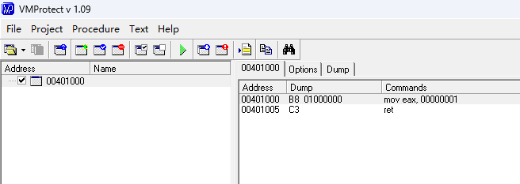

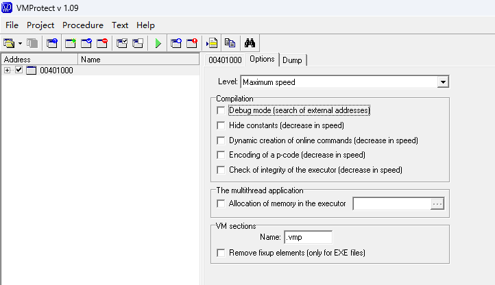

## 加壳后的PE

加壳后的样本多了两个节，分别是`vmp0`和`vmp1`，这两个节存储着VMP的运行时信息，比如字节码，壳代码等。

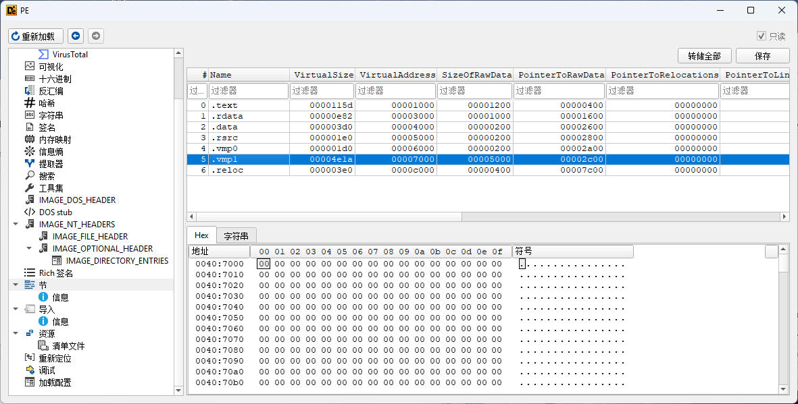

## 使用IDA分析加壳后的样本

用IDA打开加密后的样本，跳转到`testVMP()`函数所在位置。

与原始代码相比，加壳后的函数体被替换为了一条`jmp`指令，这就是虚拟机的入口。

原始：

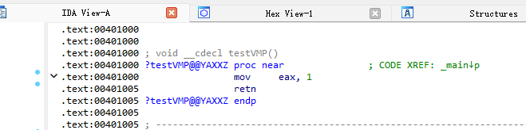

VMP加壳后：

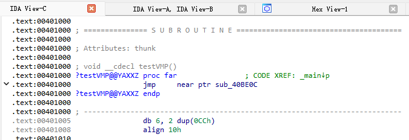

在IDA中双击`jmp`指令的目标地址，会跳转到另一处代码，如下所示：

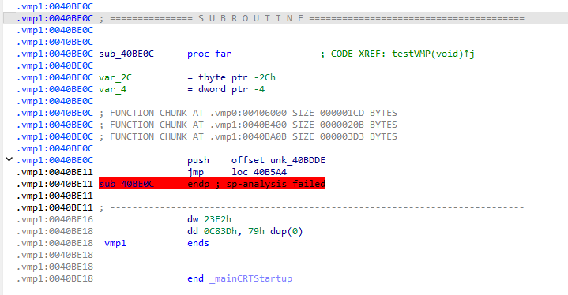

例程`sub_40BE0C`看似只有两行代码，并且后续指令IDA无法正确反汇编：

```asm
push    offset unk_40BDDE
jmp     loc_40B5A4
```

很多人看到这里可能会一头雾水。经过分析后发现，`push 0x40BDDE`这个值最终会被加载到`esi`中，而`esi`正是虚拟机的指令地址（vIP）。

因此，在IDA中直接跳转到该值对应的地址，就能看到VMP的字节码，如下图所示：

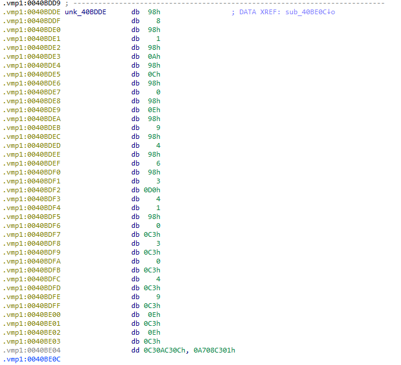

继续双击`jmp loc_40B5A4`地址进行跳转，如下图所示：

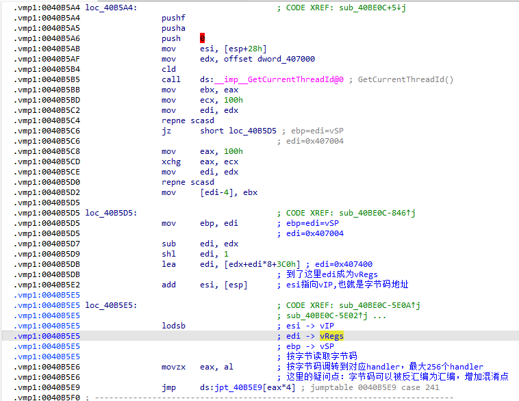

可以看到代码量明显增多，这些就是VMP取码、解码、执行的代码。

### VMP1.09执行分析

#### 首先是3个`push`指令

`pushf`和`pusha`用于保存进入虚拟机前CPU的环境，以便在虚拟机内部使用和退出时恢复。

`push 0`的值是重定位偏移。前面提到过，`push 0x40BDDE`这个值是字节码存放的地址，但它是一个硬编码的绝对地址，因此需要用重定位偏移来修正。

之所以在IDA中显示为`push 0`，是因为IDA默认的`IMAGE_BASE`是`0x400000`，而实际加载的镜像可能因重定位导致基址发生变化。

```asm
.vmp1:0040B5A4                 pushf
.vmp1:0040B5A5                 pusha
.vmp1:0040B5A6                 push    0
```

#### 虚拟机相关寄存器初始化

经过分析可以发现，`esi`指向当前指令地址（即vIP），`edi`指向虚拟机内部寄存器（即vRegs），`ebp`指向虚拟机栈（即vSP）。

```asm
.vmp1:0040B5D5                 mov     ebp, edi        ; ebp=edi=vSP
.vmp1:0040B5D5                                         ; edi=0x407004
.vmp1:0040B5D7                 sub     edi, edx
.vmp1:0040B5D9                 shl     edi, 1
.vmp1:0040B5DB                 lea     edi, [edx+edi*8+3C0h] ; edi=0x407400
.vmp1:0040B5DB                                         ; 到了这里edi成为vRegs
.vmp1:0040B5E2                 add     esi, [esp]      ; esi指向vIP,也就是字节码地址
```

以上代码之前还有若干行代码，但它们的作用都是计算和初始化正确的`esi`、`edi`、`ebp`值，这里不再赘述。

#### 虚拟机循环执行

这里能看到，`IDA`已经正确解析了`handler table`。

```asm
.vmp1:0040B5E5 loc_40B5E5:                             ; CODE XREF: sub_40BE0C-5E0A↑j
.vmp1:0040B5E5                                         ; sub_40BE0C-5E02↑j ...
.vmp1:0040B5E5                 lodsb                   ; esi -> vIP
.vmp1:0040B5E5                                         ; edi -> vRegs
.vmp1:0040B5E5                                         ; ebp -> vSP
.vmp1:0040B5E5                                         ; 按字节读取字节码
.vmp1:0040B5E6                 movzx   eax, al         ; 按字节码调转到对应handler，最大256个handler
.vmp1:0040B5E6                                         ; 这里的疑问点：字节码可以被反汇编为汇编，增加混淆点
.vmp1:0040B5E9                 jmp     ds:jpt_40B5E9[eax*4] ; jumptable 0040B5E9 case 241
```

`lodsb`指令从`esi`读取一个字节到`al`，然后根据这个字节值跳转到对应的`handler`处理。由于`al`最大值为`0xff`，因此最多可以支持256个`handler`。

#### 虚拟机处理程序

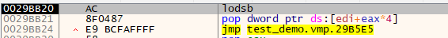

根据动态调试，我找到了第一次进入的`vm handler`，如下所示：

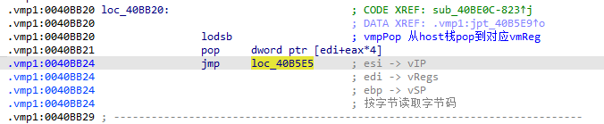

1. 通过`lodsb`加载一个字节，也就是指令后面跟着的立即数。
2. 从栈顶弹出一个值，存入`[edi+eax*4]`中。`edi`如前所述，是虚拟机私有寄存器数组的基址。
3. 最后跳转回`0x40B5E5`，形成循环执行。

分析代码可知，这个功能是`vPop4 reg`，即：将虚拟机栈顶的数据弹出到对应的虚拟机寄存器中。

动态调试发现，该`handler`对应的字节码是`0x98`，后面紧跟的立即数字节码是`0x8`。因此`vPop4 reg`指令对应的字节码格式为`0x98 0xXX`。

### x64dbg批量获取vm_handler

以此类推，其他所有虚拟机指令都可以用这种方法来分析。但虚拟机指令数量众多，逐条单步分析过于繁琐，这里我改用条件断点来批量获取。

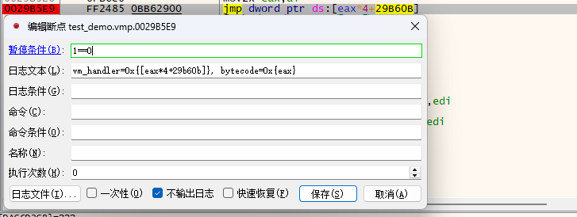

```text
vm_handler=0x29BB20, bytecode=0x98
vm_handler=0x29BB20, bytecode=0x98
vm_handler=0x29BB20, bytecode=0x98
vm_handler=0x29BB20, bytecode=0x98
vm_handler=0x29BB20, bytecode=0x98
vm_handler=0x29BB20, bytecode=0x98
vm_handler=0x29BB20, bytecode=0x98
vm_handler=0x29BB20, bytecode=0x98
vm_handler=0x29BB20, bytecode=0x98
vm_handler=0x29BB20, bytecode=0x98
vm_handler=0x29BA4E, bytecode=0xD0  vPop32_ECX

                                    vMov reg, imm
vm_handler=0x296104, bytecode=0x04  vPush8 imm
vm_handler=0x29BB20, bytecode=0x98  vPop32 reg

vm_handler=0x29BAD2, bytecode=0xC3
vm_handler=0x29BAD2, bytecode=0xC3
vm_handler=0x29BAD2, bytecode=0xC3
vm_handler=0x29BAD2, bytecode=0xC3
vm_handler=0x29BAD2, bytecode=0xC3
vm_handler=0x29BAD2, bytecode=0xC3
vm_handler=0x29BAD2, bytecode=0xC3
vm_handler=0x29BAD2, bytecode=0xC3
vm_handler=0x29BAD2, bytecode=0xC3
vm_handler=0x29BAD2, bytecode=0xC3
vm_handler=0x29BC69, bytecode=0xA7 vExit
```

`VMP`不是使用单条指令实现某个汇编功能，比如`vMov`指令是由一个`vPush8`和一个`vPop32`组合而成。

## VMP1.09函数调用分析

### VMP函数调用分析

* 将两个函数都进行VMP保护，分析其调用流程

```cpp
#include <iostream>
#include <windows.h>

__declspec(naked) void testCall() {
    __asm {
        push ebp
        mov ebp, esp
        push [ebp+8]
        push [ebp+0xc]
        push 0
        push 0
        call MessageBoxA
        add esp, 0x10
        pop ebp
        ret
    }
}

__declspec(naked) void testVMP() {
    __asm {
        push ebp
        mov ebp, esp
        push 0
        push 0
        call testCall
        add esp, 8
        pop ebp
        ret
    }
}

int main()
{
    testVMP();

    std::cout << "Hello World!\n";
}
```

* VMP虚拟机调用流程如下：

```text

-> 虚拟机程序地址: 0xF4B9B9

vmHandler: handler addr=0xF4BB25, handler index=0xE8
vmHandler: handler addr=0xF4BB25, handler index=0xE8
vmHandler: handler addr=0xF4BB25, handler index=0xE8
vmHandler: handler addr=0xF4BB25, handler index=0xE8
vmHandler: handler addr=0xF4BB25, handler index=0xE8
vmHandler: handler addr=0xF4BB25, handler index=0xE8
vmHandler: handler addr=0xF4BB25, handler index=0xE8
vmHandler: handler addr=0xF4BB25, handler index=0xE8
vmHandler: handler addr=0xF4BB25, handler index=0xE8
vmHandler: handler addr=0xF4BB25, handler index=0xE8

vmHandler: handler addr=0xF41012, handler index=0x7A  # 平衡栈

                                                      # vmmPushEBP
                                                        这里有一个隐含的映射关系，这个关系和上面vmEnter是恢复vmp环境的顺序有关，
                                                        比如vreg1 -> ebp，但是不确定vreg1是否始终隐射到ebp
vmHandler: handler addr=0xF4B941, handler index=0xA8  # vmmPushDWORD vreg_1 (ebp)

                                                      # vmmMovVSPToReg reg
vmHandler: handler addr=0xF4BCCE, handler index=0xC9  # vmmPushHostStack
vmHandler: handler addr=0xF4BB25, handler index=0xE8  # vmmPopDWORD vreg_f

vmHandler: handler addr=0xF4B98B, handler index=0xEC  # vmmPushBYTE imm (0)
vmHandler: handler addr=0xF4B98B, handler index=0xEC  # vmmPushBYTE imm (0)

                                                      # vmmAdd 0xB40000, 0x40BEFA (calc call ptr)
vmHandler: handler addr=0xF4B941, handler index=0x4D  # vmmPushDWORD vreg_1 (0xB40000 -> offset)
vmHandler: handler addr=0xF4B433, handler index=0x76  # vmmPushDWORD imm (0x40BEFA)
vmHandler: handler addr=0xF4BB5A, handler index=0x05  # vmmAddHostStackWithHostEax

vmHandler: handler addr=0xF4B433, handler index=0x66  # vmmPushDWORD imm (0x40BE15)

                                                      # vmmAdd 0xB40000, 0040B9B9 (calc call ptr)
vmHandler: handler addr=0xF4B941, handler index=0x4D  # vmmPopDWORD vreg_c (0xB40000)
vmHandler: handler addr=0xF4B433, handler index=0x66  # vmmPushDWORD imm (0040B9B9)
vmHandler: handler addr=0xF4BB5A, handler index=0x05  # vmmAddHostStackWithHostEax

vmHandler: handler addr=0xF4B941, handler index=0xA8  # vmmPushDWORD reg
vmHandler: handler addr=0xF4B941, handler index=0x4D  # vmmPushDWORD reg
vmHandler: handler addr=0xF4B941, handler index=0xA8  # vmmPushDWORD reg
vmHandler: handler addr=0xF4B941, handler index=0xA8  # vmmPushDWORD reg
vmHandler: handler addr=0xF4B941, handler index=0xA8  # vmmPushDWORD reg
vmHandler: handler addr=0xF4B941, handler index=0x4D  # vmmPushDWORD reg
vmHandler: handler addr=0xF4B941, handler index=0x4D  # vmmPushDWORD reg
vmHandler: handler addr=0xF4B941, handler index=0x4D  # vmmPushDWORD reg
vmHandler: handler addr=0xF4B941, handler index=0xA8  # vmmPushDWORD reg
vmHandler: handler addr=0xF4B941, handler index=0x4D  # vmmPushDWORD reg

vmHandler: handler addr=0xF4BB7E, handler index=0x81  # vmmExit

                                                      # vmmExit之后会进入新的字节码，新字节码地址在上面的字节码执行时，已经push到栈中
                                                      # 调用虚拟机函数与调用非虚拟机函数类似，都会通过vmExit跳转
                                                      # TODO: 调转指令待验证


-> 虚拟机程序地址: 0xF4B9B9
   字节码地址:  0x40BE15

                                                      # vmmEnter
vmHandler: handler addr=0xF4BB25, handler index=0xE8
vmHandler: handler addr=0xF4BB25, handler index=0xE8
vmHandler: handler addr=0xF4BB25, handler index=0xE8
vmHandler: handler addr=0xF4BB25, handler index=0xE8
vmHandler: handler addr=0xF4BB25, handler index=0xE8
vmHandler: handler addr=0xF4BB25, handler index=0xE8
vmHandler: handler addr=0xF4BB25, handler index=0xE8
vmHandler: handler addr=0xF4BB25, handler index=0xE8
vmHandler: handler addr=0xF4BB25, handler index=0xE8
vmHandler: handler addr=0xF4BB25, handler index=0xE8
vmHandler: handler addr=0xF4BB25, handler index=0xE8

vmHandler: handler addr=0xF4B941, handler index=0x4D  # vmmPushDWORD vreg_1 (ebp)

                                                      # vmmMoveVSPToReg
vmHandler: handler addr=0xF4BCCE, handler index=0xE4  # vmmPushHostStack
vmHandler: handler addr=0xF4BB25, handler index=0xE8  # vmmPopReg reg_a


--------------------------------------------------------------------------------------------
                                                      # vmmGetAndPush (vmmAdd(8, 0x8FFDF0))

                                                      # vmmAdd 8, 0x8FFDF0
vmHandler: handler addr=0xF4B98B, handler index=0xEC  # vmmPushByte imm (8)
vmHandler: handler addr=0xF4B941, handler index=0x4D  # vmmPushReg reg_a (0x8FFDF0)
vmHandler: handler addr=0xF4BB5A, handler index=0x05  # vmmAddHostStackWithHostEax

vmHandler: handler addr=0xF4BAD5, handler index=0x2A  # vmmGetAndPushVal
--------------------------------------------------------------------------------------------


--------------------------------------------------------------------------------------------
                                                      # vmmGetAndPush (vmmAdd(8, 0x8FFDF0))

                                                      # vmmAdd 0xF4B57F, 0xc
vmHandler: handler addr=0xF4B941, handler index=0x4D  # vmmPushReg reg_A (0xF4B57F)
vmHandler: handler addr=0xF4B98B, handler index=0xEC  # vmmPushByte imm (0xc)
vmHandler: handler addr=0xF4BB5A, handler index=0x05  # vmmAddHostStackWithHostEax

vmHandler: handler addr=0xF4BAD5, handler index=0x2A  # vmmGetAndPushVal
--------------------------------------------------------------------------------------------


vmHandler: handler addr=0xF4B98B, handler index=0xEC  # vmmPushByte imm (0)
vmHandler: handler addr=0xF4B98B, handler index=0xEC  # vmmPushByte imm (0)

                                                      # vmmAdd 0x40BEEE, 0xB40000
vmHandler: handler addr=0xF4B433, handler index=0x66  # vmmPushDWORD imm
vmHandler: handler addr=0xF4B941, handler index=0x4D  # vmmPushReg reg_8
vmHandler: handler addr=0xF4BB5A, handler index=0x05  # vmmAddHostStackWithHostEax


--------------------------------------------------------------------------------------------
                                                      # vmmGetAndPush (vmmAdd(0xB40000, 0x403058))

                                                      # vmmAdd 0xB40000, 0x403058
vmHandler: handler addr=0xF4B941, handler index=0xA8  # vmmPushReg reg_8 (0xB40000)
vmHandler: handler addr=0xF4B433, handler index=0x76  # vmmPushDWORD imm (0x403058)
vmHandler: handler addr=0xF4BB5A, handler index=0x05  # vmmAddHostStackWithHostEax

vmHandler: handler addr=0xF460CF, handler index=0x12  # vmmGetAndPushVal
--------------------------------------------------------------------------------------------

上方代码执行完之后的栈
008FFDD8  75A07F60  user32.MessageBoxA
008FFDDC  00F4BEEE  test_demo.vmp.__dyn_tls_init_callback+7B22
^^^^^^^^^^^^^^^^^^^^^^^^^^^^^^^^^^^^^^^^^^^^^^^^^^^^^^^^^^^^^^^^^^^^^^^^^^^^^^^^^^^^^^^^^^^^

vmHandler: handler addr=0xF4B941, handler index=0xA8  # vmmPushReg reg
vmHandler: handler addr=0xF4B941, handler index=0xA8  # vmmPushReg reg
vmHandler: handler addr=0xF4B941, handler index=0x4D  # vmmPushReg reg
vmHandler: handler addr=0xF4B941, handler index=0xA8  # vmmPushReg reg
vmHandler: handler addr=0xF4B941, handler index=0x4D  # vmmPushReg reg
vmHandler: handler addr=0xF4B941, handler index=0x4D  # vmmPushReg reg
vmHandler: handler addr=0xF4B941, handler index=0xA8  # vmmPushReg reg
vmHandler: handler addr=0xF4B941, handler index=0xA8  # vmmPushReg reg
vmHandler: handler addr=0xF4B941, handler index=0xA8  # vmmPushReg reg
vmHandler: handler addr=0xF4B941, handler index=0x4D  # vmmPushReg reg

vmHandler: handler addr=0xF4BB7E, handler index=0x81  # vmmExit 这里应该调用MessageBox

vmHandler: handler addr=0xF4BB25, handler index=0xE8
vmHandler: handler addr=0xF4BB25, handler index=0xE8
vmHandler: handler addr=0xF4BB25, handler index=0xE8
vmHandler: handler addr=0xF4BB25, handler index=0xE8
vmHandler: handler addr=0xF4BB25, handler index=0xE8
vmHandler: handler addr=0xF4BB25, handler index=0xE8
vmHandler: handler addr=0xF4BB25, handler index=0xE8
vmHandler: handler addr=0xF4BB25, handler index=0xE8
vmHandler: handler addr=0xF4BB25, handler index=0xE8
vmHandler: handler addr=0xF4BB25, handler index=0xE8
vmHandler: handler addr=0xF4BB25, handler index=0xE8

vmHandler: handler addr=0xF4B98B, handler index=0xEC
vmHandler: handler addr=0xF4B98B, handler index=0xEC
vmHandler: handler addr=0xF4BCCE, handler index=0xE4
vmHandler: handler addr=0xF4BB5A, handler index=0x05
vmHandler: handler addr=0xF4BADE, handler index=0x8F
vmHandler: handler addr=0xF4B86F, handler index=0xBC
vmHandler: handler addr=0xF4BD86, handler index=0xFD
vmHandler: handler addr=0xF4BCCE, handler index=0xE4
vmHandler: handler addr=0xF4BC0B, handler index=0x1B
vmHandler: handler addr=0xF4BBF5, handler index=0x7C
vmHandler: handler addr=0xF4BBF5, handler index=0x7C
vmHandler: handler addr=0xF4BACA, handler index=0xF7
vmHandler: handler addr=0xF460FA, handler index=0xC3
vmHandler: handler addr=0xF4613F, handler index=0xC1
vmHandler: handler addr=0xF4BB25, handler index=0xE8
vmHandler: handler addr=0xF4B941, handler index=0x4D
vmHandler: handler addr=0xF4B941, handler index=0x4D
vmHandler: handler addr=0xF4B941, handler index=0x4D
vmHandler: handler addr=0xF4B941, handler index=0xA8
vmHandler: handler addr=0xF4B941, handler index=0x4D
vmHandler: handler addr=0xF4B941, handler index=0xA8
vmHandler: handler addr=0xF4B941, handler index=0xA8
vmHandler: handler addr=0xF4B941, handler index=0xA8
vmHandler: handler addr=0xF4B941, handler index=0xA8
vmHandler: handler addr=0xF4B941, handler index=0x4D
vmHandler: handler addr=0xF4BB7E, handler index=0x81
```

* 对于同为VMP保护的函数，它们之间的调用会通过`vmExit`，先退出当前虚拟机，再进入另一个虚拟机，不过它们的虚拟机程序都是同一个。

### 非VMP函数调用分析

```cpp
#include <iostream>
#include <windows.h>

__declspec(naked) void testVMP() {
    __asm {
        push 0
        push 0
        push 0
        push 0
        call MessageBoxA
        ret
    }
}

int main()
{
    testVMP();

    std::cout << "Hello World!\n";
}
```

* 对于非VMP保护函数的调用，流程如下：

```text
                                                       # vmpEnvSave
vmHanlder: handler addr=0x9860F8,  handler index=0xA9  # vmpPopReg reg
vmHanlder: handler addr=0x9860F8,  handler index=0xA9
vmHanlder: handler addr=0x9860F8,  handler index=0xA9
vmHanlder: handler addr=0x9860F8,  handler index=0xA9
vmHanlder: handler addr=0x9860F8,  handler index=0xA9
vmHanlder: handler addr=0x9860F8,  handler index=0xA9
vmHanlder: handler addr=0x9860F8,  handler index=0xA9
vmHanlder: handler addr=0x9860F8,  handler index=0xA9
vmHanlder: handler addr=0x9860F8,  handler index=0xA9
vmHanlder: handler addr=0x9860F8,  handler index=0xA9

vmHanlder: handler addr=0x98BAE8,  handler index=0xBE  # 平衡栈
                                                       # 压入MessageBox的参数
vmHanlder: handler addr=0x986015,  handler index=0xD4  # vmpPush
vmHanlder: handler addr=0x986015,  handler index=0xD4
vmHanlder: handler addr=0x986015,  handler index=0xD4
vmHanlder: handler addr=0x986015,  handler index=0xD4

                                                       # vmpPrepareCall
                                                       # 1. 压入Call之后的返回值，因为外部Call调用完成后还要返回VMP继续执行，所以压入的也是`vmpEnter`地址
                                                       # 2. 压入调用地址
                                                       # 3. 退出VMP

                                                       # vmpPushRet
vmHanlder: handler addr=0x9860E5,  handler index=0x83  # vmpPushDWORD imm
vmHanlder: handler addr=0x98BC5D,  handler index=0xFE  # vmpPushDWORD reg
vmHanlder: handler addr=0x98B44F,  handler index=0x72  # vmpAdd ^-> imm=imm+reg

                                                       # vmpPushCallPtr
vmHanlder: handler addr=0x98BC5D,  handler index=0xFE  # vmpPushDWORD reg
vmHanlder: handler addr=0x9860E5,  handler index=0x83  # vmpPushDWORD imm
vmHanlder: handler addr=0x98B44F,  handler index=0x72  # vmpAdd ^-> reg=reg+imm
vmHanlder: handler addr=0x98B50C,  handler index=0x96  # vmpGetCallPtr

                                                       # vmpEnvRestore
vmHanlder: handler addr=0x98BC5D,  handler index=0xFE  # vmpPushReg reg
vmHanlder: handler addr=0x98BC5D,  handler index=0xFE
vmHanlder: handler addr=0x98BC5D,  handler index=0xFE
vmHanlder: handler addr=0x98BC5D,  handler index=0xFE
vmHanlder: handler addr=0x98BC5D,  handler index=0xFE
vmHanlder: handler addr=0x98BC5D,  handler index=0xFE
vmHanlder: handler addr=0x98BC5D,  handler index=0xFE
vmHanlder: handler addr=0x98BC5D,  handler index=0xFE
vmHanlder: handler addr=0x98BC5D,  handler index=0xFE
vmHanlder: handler addr=0x98BC5D,  handler index=0xFE

                                                      # VMP通过vmExit的方式调用Call，Call地址在之前已经压入栈，
                                                      # 而函数调用后的返回地址是vmEnter，也就是Call调用之后再次进入VMP
vmHanlder: handler addr=0x98BABE,  handler index=0xA2 # vmpExit

vmHanlder: handler addr=0x9860F8,  handler index=0xA9
vmHanlder: handler addr=0x9860F8,  handler index=0xA9
vmHanlder: handler addr=0x9860F8,  handler index=0xA9
vmHanlder: handler addr=0x9860F8,  handler index=0xA9
vmHanlder: handler addr=0x9860F8,  handler index=0xA9
vmHanlder: handler addr=0x9860F8,  handler index=0xA9
vmHanlder: handler addr=0x9860F8,  handler index=0xA9
vmHanlder: handler addr=0x9860F8,  handler index=0xA9
vmHanlder: handler addr=0x9860F8,  handler index=0xA9
vmHanlder: handler addr=0x9860F8,  handler index=0xA9
vmHanlder: handler addr=0x9860F8,  handler index=0xA9

                                                      # 全部完成后执行vmExit
vmHanlder: handler addr=0x98BC5D,  handler index=0xFE
vmHanlder: handler addr=0x98BC5D,  handler index=0xFE
vmHanlder: handler addr=0x98BC5D,  handler index=0xFE
vmHanlder: handler addr=0x98BC5D,  handler index=0xFE
vmHanlder: handler addr=0x98BC5D,  handler index=0xFE
vmHanlder: handler addr=0x98BC5D,  handler index=0xFE
vmHanlder: handler addr=0x98BC5D,  handler index=0xFE
vmHanlder: handler addr=0x98BC5D,  handler index=0xFE
vmHanlder: handler addr=0x98BC5D,  handler index=0xFE
vmHanlder: handler addr=0x98BC5D,  handler index=0xFE
vmHanlder: handler addr=0x98BABE,  handler index=0xA2
```

* 也是通过`vmExit`调用。

## VMP1.09最大保护

### 样本代码

```cpp
#include <iostream>
#include <windows.h>

__declspec(naked) void testVMP() {
    __asm {
        mov eax, 1
        ret
    }
}

int main()
{
    testVMP();
    std::cout << "Hello World!\n";
}
```

### VMP加壳

选择`Maximum protection`。

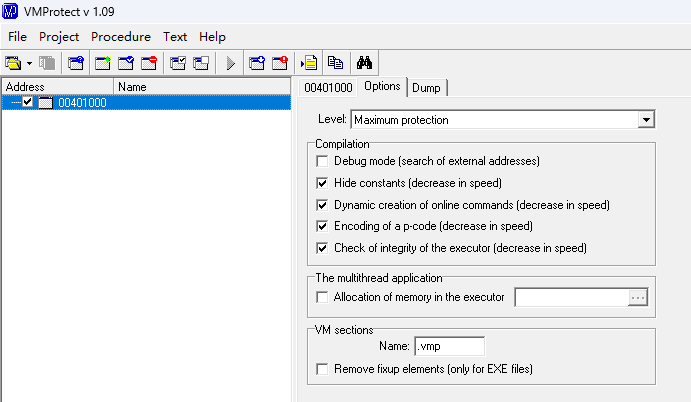

### IDA分析样本

`Maximum protection`与`Maximum speed`类似，只不过`Maximum protection`增加了对指令和内存的加解密。分析流程与前面的方法类似。

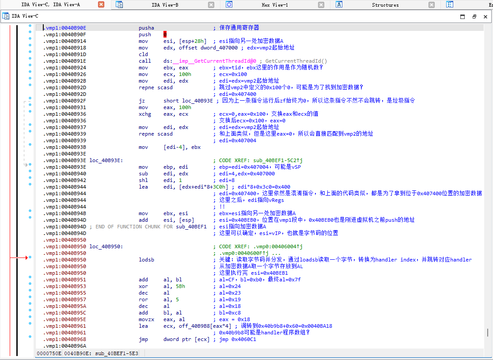

## VMP栈和虚拟机寄存器

### vmEnter前

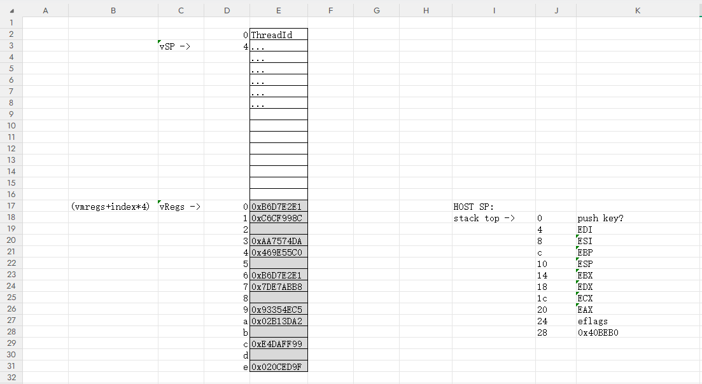

### vmEnter后

原本保存的`通用寄存器`和`eflags`被加载到`虚拟机寄存器`。

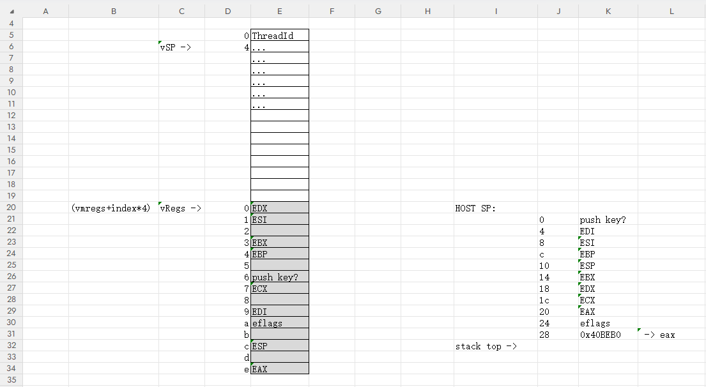

### 经过几个Handler后

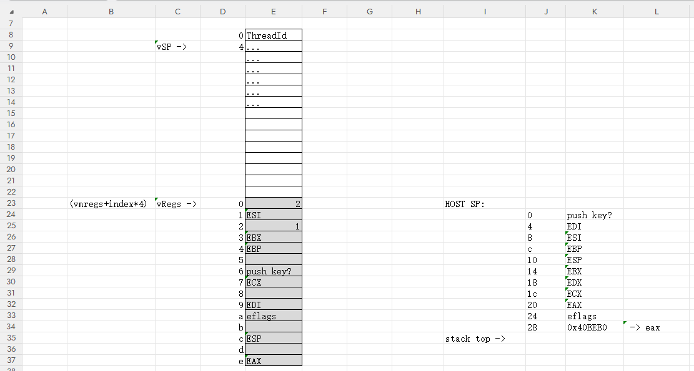

---

::: tip 版权声明
本文版权归 [lee0xb1t](https://github.com/lee0xb1t) 所有，未经许可不得以任何形式转载。
:::
