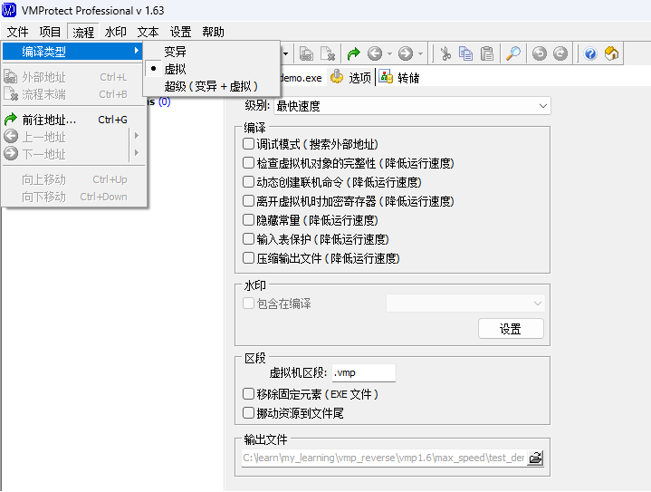
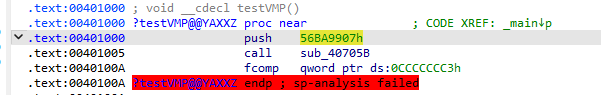
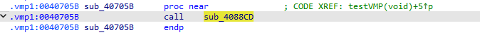
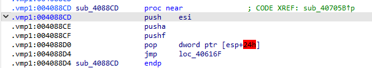
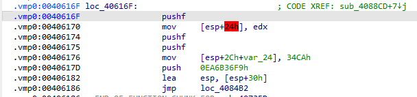
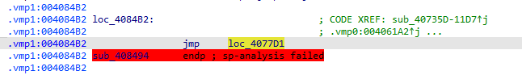
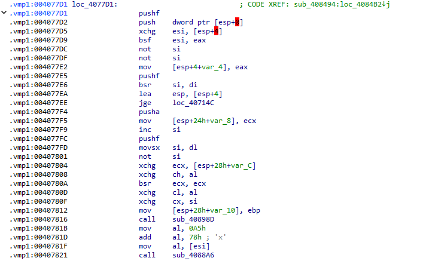
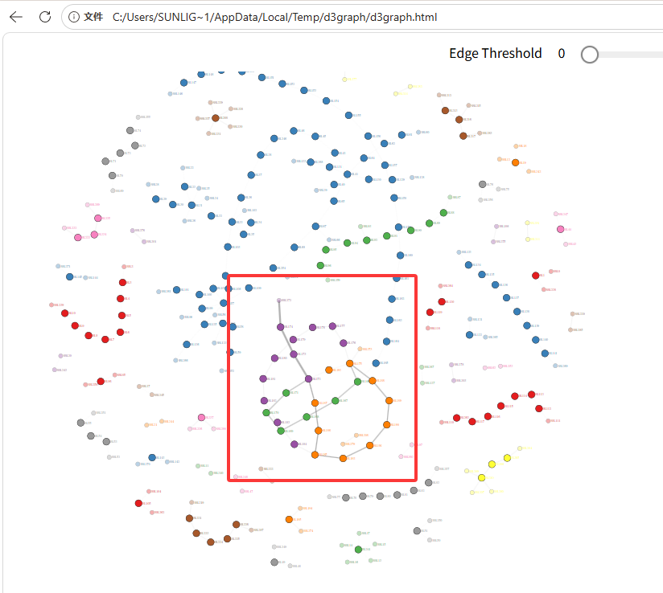
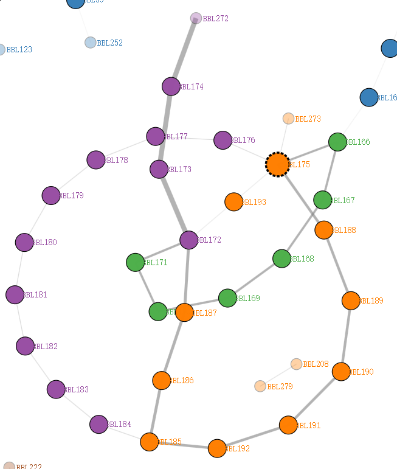

## VMP1.63版本变化

与`VMP1.09`相比，增加了`编译选项`，还有`输入表保护`和`压缩壳`等功能。



## 样本分析

样本代码如下：

```cpp
#include <iostream>
#include <windows.h>

__declspec(naked) void testVMP() {
    __asm {
        mov eax, 0xaaaa
        mov ebx, 0xbbbb
        add eax, ebx
        ret
    }
}

int main()
{
    testVMP();
    MessageBoxA(0, 0, 0, 0);

    std::cout << "Hello World!\n";
}
```

## VMP1.63加壳

选择`最快速度`加壳。

## IDA分析样本

**（这里我只分析VMP1.63的虚拟机代码，因为我想将更多时间用在分析后续版本）**

### 调用流程

* 函数被VMP的跳转代码：



* 双击进入代码段：



* 双击进入代码段：



* 双击进入代码段：



* 双击进入代码段：



* 双击进入代码段：



可以看到VMP1.63的虚拟机代码非常复杂，仅靠手动分析几乎不可能完成，更不用说添加`代码变异`选项后得到的VMP壳代码。

## 借助Graph数据结构分析VMP1.63

### 基础概念：基本块

基本块（Basic Block）指一段连续的指令序列，指令序列中间没有跳转，指令序列的最后一条指令是退出。基本块是`编译原理`中的概念，主要用于编译器分析和优化程序。

### VMP代码与基本块

从上面的调用流程可以看出，VMP1.63为了增加逆向难度，将原本完整的虚拟机代码分割成不同的块，这些块可以看成是一个个`基本块`。只要分析这些`基本块`的调用序列，也就能分析出虚拟机代码的整体流程。

回忆上一章节的内容，可以确定的几点是：执行频率最高的一定是`vm_dispatch`，也就是虚拟机解码后跳转到对应`handler`的代码，并且存在一个`取码->解码->执行->再到取码`的循环。而这个循环可以用`图数据结构`分析出来。

### Intel Pin

为了能够获取到程序的基本块以及调用序列，需要借助`Intel Pin`工具。

`Intel Pin`是一个代码插桩工具，他可以将可执行文件的机器码编译为字节码，然后接管原本程序的运行。

比如，它可以为指令增加回调函数，当指令执行后，它会调用用户编写的回调函数。

插桩范围：

* IMG：Image加载或卸载时调用回调
  
* INS：指令被执行前或执行后调用回调
  
* RTN：函数被调用时调用回调（需要借助调试符号）
  
* TRACE：基本块被执行时调用回调

关于`Intel Pin`更多内容这里不再过多赘述，有兴趣可以[阅读官方文档](https://www.intel.com/content/www/us/en/developer/articles/tool/pin-a-dynamic-binary-instrumentation-tool.html)。

### Intel Pin 获取基本块执行流

[代码在这里](https://github.com/lee0xb1t/my_learning/blob/main/vmp_reverse/vmp1.6/vmp16_trace/bbl_trace.cpp)

我将`主模块`所有执行到的基本块做了记录，结果如下：

```text
ADDR:3413346,numInst:1,branch_target:3414319
ADDR:3414319,numInst:7,branch_target:3414345
ADDR:3414341,numInst:2,branch_target:3414383
ADDR:3414383,numInst:5,branch_target:3413351
...
...
...
ADDR:3416080,numInst:1,branch_target:1975932608
ADDR:3415024,numInst:6,branch_target:3415065
ADDR:3415065,numInst:3,branch_target:1975751300
===============================================
VMP Pin Tool analysis results: 
Number of instructions: 4346
Number of basic blocks: 560
Number of threads: 7
Address of main module: 0x340000
===============================================
```

`ADDR`为基本块的起始地址（也就是第一条指令的地址），`branch_target`是目标地址（也就是最后一条指令跳转到的地址）。

我们可以将每一个`ADDR`看作是一个`图节点`，`branch_target`看作是`节点的方向`。

### 使用d3graph分析

[代码在这里](https://github.com/lee0xb1t/my_learning/blob/main/vmp_reverse/vmp1.6/graph_analysis/analysis.py)

[流程图地址](../../html/d3graph_bbl.html)



* 可以在图中看到几个非常奇怪的节点：

周围的节点总是指向`BBL175`，这似乎符合`解码`循环。



* 查看`BBL175`相关的节点，可以看到有5个去向，这5个目标地址可能就是`vm_handler`的具体地址。

```text
{'source': 'BBL175', 'target': 'BBL166', 'source_addr': '0x34772f', 'target_addr': '0x3472bf', 'id': 184}
{'source': 'BBL175', 'target': 'BBL176', 'source_addr': '0x34772f', 'target_addr': '0x34752e', 'id': 294}
{'source': 'BBL175', 'target': 'BBL188', 'source_addr': '0x34772f', 'target_addr': '0x348579', 'id': 346}
{'source': 'BBL175', 'target': 'BBL193', 'source_addr': '0x34772f', 'target_addr': '0x3473a3', 'id': 370}
{'source': 'BBL175', 'target': 'BBL273', 'source_addr': '0x34772f', 'target_addr': '0x348bd3', 'id': 515}
```

* 其中`BBL176`方向的线最细，只有两条数据，和上方的样本代码的两个`mov`指令对应，`BBL175`的整体调用流程如下：

```text
{'source': 'BBL175', 'target': 'BBL166', 'source_addr': '0x34772f', 'target_addr': '0x3472bf', 'id': 184}
{'source': 'BBL175', 'target': 'BBL166', 'source_addr': '0x34772f', 'target_addr': '0x3472bf', 'id': 194}
{'source': 'BBL175', 'target': 'BBL166', 'source_addr': '0x34772f', 'target_addr': '0x3472bf', 'id': 204}
{'source': 'BBL175', 'target': 'BBL166', 'source_addr': '0x34772f', 'target_addr': '0x3472bf', 'id': 214}
{'source': 'BBL175', 'target': 'BBL166', 'source_addr': '0x34772f', 'target_addr': '0x3472bf', 'id': 224}
{'source': 'BBL175', 'target': 'BBL166', 'source_addr': '0x34772f', 'target_addr': '0x3472bf', 'id': 234}
{'source': 'BBL175', 'target': 'BBL166', 'source_addr': '0x34772f', 'target_addr': '0x3472bf', 'id': 244}
{'source': 'BBL175', 'target': 'BBL166', 'source_addr': '0x34772f', 'target_addr': '0x3472bf', 'id': 254}
{'source': 'BBL175', 'target': 'BBL166', 'source_addr': '0x34772f', 'target_addr': '0x3472bf', 'id': 264}
{'source': 'BBL175', 'target': 'BBL166', 'source_addr': '0x34772f', 'target_addr': '0x3472bf', 'id': 274}

                                                                                                          (这里是我分析的，不用管)
{'source': 'BBL175', 'target': 'BBL166', 'source_addr': '0x34772f', 'target_addr': '0x3472bf', 'id': 284} vPop4 reg

                                                                                                          vMov reg, imm
{'source': 'BBL175', 'target': 'BBL176', 'source_addr': '0x34772f', 'target_addr': '0x34752e', 'id': 294} vPush4 imm
{'source': 'BBL175', 'target': 'BBL166', 'source_addr': '0x34772f', 'target_addr': '0x3472bf', 'id': 310} vPop4 reg

                                                                                                          vMov reg, imm
{'source': 'BBL175', 'target': 'BBL176', 'source_addr': '0x34772f', 'target_addr': '0x34752e', 'id': 320} vPush4 imm
{'source': 'BBL175', 'target': 'BBL166', 'source_addr': '0x34772f', 'target_addr': '0x3472bf', 'id': 336} vPop4 reg

                                                                                                          vAdd reg, reg
{'source': 'BBL175', 'target': 'BBL188', 'source_addr': '0x34772f', 'target_addr': '0x348579', 'id': 346} vPush4 reg
{'source': 'BBL175', 'target': 'BBL188', 'source_addr': '0x34772f', 'target_addr': '0x348579', 'id': 358} vPush4 reg
{'source': 'BBL175', 'target': 'BBL193', 'source_addr': '0x34772f', 'target_addr': '0x3473a3', 'id': 370} vAdd4

{'source': 'BBL175', 'target': 'BBL166', 'source_addr': '0x34772f', 'target_addr': '0x3472bf', 'id': 375} vPop4 reg
{'source': 'BBL175', 'target': 'BBL166', 'source_addr': '0x34772f', 'target_addr': '0x3472bf', 'id': 385} vPop4 reg

{'source': 'BBL175', 'target': 'BBL188', 'source_addr': '0x34772f', 'target_addr': '0x348579', 'id': 395}
{'source': 'BBL175', 'target': 'BBL188', 'source_addr': '0x34772f', 'target_addr': '0x348579', 'id': 407}
{'source': 'BBL175', 'target': 'BBL188', 'source_addr': '0x34772f', 'target_addr': '0x348579', 'id': 419}
{'source': 'BBL175', 'target': 'BBL188', 'source_addr': '0x34772f', 'target_addr': '0x348579', 'id': 431}
{'source': 'BBL175', 'target': 'BBL188', 'source_addr': '0x34772f', 'target_addr': '0x348579', 'id': 443}
{'source': 'BBL175', 'target': 'BBL188', 'source_addr': '0x34772f', 'target_addr': '0x348579', 'id': 455}
{'source': 'BBL175', 'target': 'BBL188', 'source_addr': '0x34772f', 'target_addr': '0x348579', 'id': 467}
{'source': 'BBL175', 'target': 'BBL188', 'source_addr': '0x34772f', 'target_addr': '0x348579', 'id': 479}
{'source': 'BBL175', 'target': 'BBL188', 'source_addr': '0x34772f', 'target_addr': '0x348579', 'id': 491}
{'source': 'BBL175', 'target': 'BBL188', 'source_addr': '0x34772f', 'target_addr': '0x348579', 'id': 503}
{'source': 'BBL175', 'target': 'BBL273', 'source_addr': '0x34772f', 'target_addr': '0x348bd3', 'id': 515}
```

### BBL175 的代码

代码如下：

```asm
.vmp1:0040772F                 push    edi
.vmp1:00407730                 mov     [esp], ecx
.vmp1:00407733                 pusha
.vmp1:00407734                 push    0FD61D81Fh
.vmp1:00407739                 pushf
.vmp1:0040773A                 push    dword ptr [esp+8]
.vmp1:0040773E                 push    dword ptr [esp+2Ch]
.vmp1:00407742                 retn    30h
```

最终的跳转指令使用`ret`实现，除此之外看不到有效信息，其他操作可能在前面的基本块实现。

### BBL176的去向

```text
{'source': 'BBL176', 'target': 'BBL177', 'source_addr': '0x34752e', 'target_addr': '0x347d33', 'id': 295}
{'source': 'BBL177', 'target': 'BBL178', 'source_addr': '0x347d33', 'target_addr': '0x3484c1', 'id': 296}
{'source': 'BBL178', 'target': 'BBL179', 'source_addr': '0x3484c1', 'target_addr': '0x347618', 'id': 297}
{'source': 'BBL179', 'target': 'BBL180', 'source_addr': '0x347618', 'target_addr': '0x34847f', 'id': 298}
{'source': 'BBL180', 'target': 'BBL181', 'source_addr': '0x34847f', 'target_addr': '0x346150', 'id': 299}
{'source': 'BBL181', 'target': 'BBL182', 'source_addr': '0x346150', 'target_addr': '0x3486f7', 'id': 300}
{'source': 'BBL182', 'target': 'BBL183', 'source_addr': '0x3486f7', 'target_addr': '0x34838d', 'id': 301}
{'source': 'BBL183', 'target': 'BBL184', 'source_addr': '0x34838d', 'target_addr': '0x347ed5', 'id': 302}
{'source': 'BBL184', 'target': 'BBL185', 'source_addr': '0x347ed5', 'target_addr': '0x3480d7', 'id': 303}
```

```asm
BBL176:
.vmp1:0040752E                 rcl     al, 2
.vmp1:00407531                 lahf
.vmp1:00407532                 btc     eax, ebp
.vmp1:00407535                 mov     eax, [esi]
.vmp1:00407537                 test    bl, dl
.vmp1:00407539                 cmc
.vmp1:0040753A                 pushf
.vmp1:0040753B                 pusha
.vmp1:0040753C                 add     eax, ebx
.vmp1:0040753E                 cmc
.vmp1:0040753F                 lea     esi, [esi+4]
.vmp1:00407542                 mov     dword ptr [esp], 3F6FFB5Ah
.vmp1:00407549                 add     eax, 0F72D6FDAh
.vmp1:0040754E                 jmp     loc_407D33

BBL177:
.vmp1:00407D33                 call    sub_4084C1

BBL178:
.vmp1:004084C1                 mov     [esp+arg_0], 0F0h
.vmp1:004084C6                 not     eax
.vmp1:004084C8                 pushf
.vmp1:004084C9                 jmp     loc_407618

BBL179:
.vmp1:00407618                 call    sub_40847F

BBL180:
.vmp1:0040847F                 dec     eax
.vmp1:00408480                 bt      di, 0Ah
.vmp1:00408485                 not     eax
.vmp1:00408487                 mov     [esp+0], dh
.vmp1:0040848A                 add     eax, 93FED0F4h
.vmp1:0040848F                 jmp     loc_406150

BBL181:
.vmp0:00406150                 stc
.vmp0:00406151                 push    [esp+arg_4]
.vmp0:00406155                 pushf
.vmp0:00406156                 rol     eax, 13h
.vmp0:00406159                 call    sub_4086F7

BBL182:
.vmp1:004086F7                 stc
.vmp1:004086F8                 cmc
.vmp1:004086F9                 mov     [esp+arg_0], 7Dh ; '}'
.vmp1:004086FE                 add     ebx, eax
.vmp1:00408700                 jmp     loc_40838D

BBL183:
.vmp1:0040838D                 push    791BDE17h
.vmp1:00408392                 pushf
.vmp1:00408393                 sub     ebp, 4
.vmp1:00408396                 pushf
.vmp1:00408397                 call    sub_407ED5

BBL184:
.vmp1:00407ED5                 mov     [ebp+0], eax
.vmp1:00407ED8                 pushf
.vmp1:00407ED9                 mov     [esp+4+var_4], 1D737FC1h
.vmp1:00407EE0                 lea     esp, [esp+50h]
.vmp1:00407EE4                 jmp     loc_4080D7
```

* 虽然`junk-code`比较多，但是依然能够找到一些主要指令：

根据[上一章](./vmp_reverse_01.md)的经验：`esi`是`vIP`，`edi`是`vRegs`，`ebp`是`vSP`，分析发现VMP1.63也以同样方式使用。

```text
.vmp1:00407535                 mov     eax, [esi]           // 取4字节立即数
.vmp1:0040753F                 lea     esi, [esi+4]         // vIP+=4

.vmp1:00408393                 sub     ebp, 4               // vSP-=4
.vmp1:00407ED5                 mov     [ebp+0], eax         // eax通过动态调试确认是样本代码中的值: 0xaaaa 和 0xbbbb
```

上面的代码相当于从`字节码`读取`4字节立即数`，并`push`到`vSP`中。

##

对于其他指令也可用使用类似的方法分析，因为这个样本没有开启`代码变异`，所以手动也能分析。

对于更复杂的指令流，一个比较好的方式是符号分析，就像上面说的，`vIP`、`vSP`、`vRegs`都存储在某些固定的寄存器中，只要追踪这些寄存器就能知道这个`vm_handler`的作用。

相关工具有`Triton`和`Miasm`，这两者都支持`符号执行引擎`，`Triton`支持`污点分析`，这个工具在后面分析高版本是会用到。

---

::: tip 版权声明
本文版权归 [lee0xb1t](https://github.com/lee0xb1t) 所有，未经许可不得以任何形式转载。
:::
