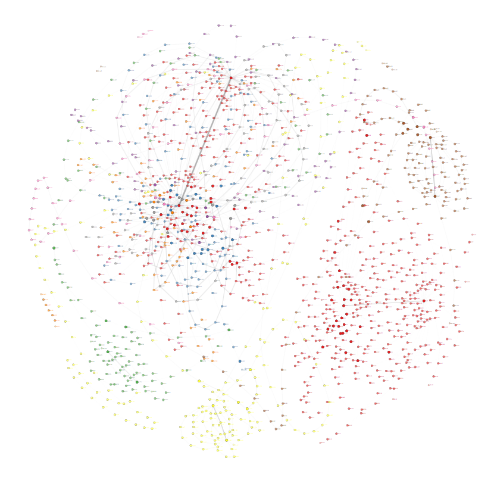

## 样本准备

样本代码如下：

```cpp
#include <iostream>
#include <windows.h>

int add(int a, int b) {
    return a + b;
}

int main()
{
    int ret = add(4, 6);
    MessageBoxA(0, 0, 0, 0);

    std::cout << "Hello World!\n";
    return ret;
}
```

## Graph 分析

* 虚拟家编译：



仔细观察可以看到存在多个执行循环，这是VMP3.5的特殊地方，存在多个虚拟机，并且虚拟机之间会跳转。

## 基本块分析

```text
BBL577:131
BBL578:131
BBL579:131

BBL52:62
BBL53:62
BBL54:62

BBL442:22
BBL443:22
BBL444:22

BBL770:12
BBL771:12
BBL772:12

BBL1380:12
BBL1381:12
BBL1382:12

BBL504:10
BBL505:10
BBL506:10
BBL507:10
...
...
...
```

通过对基本块分析可以知道，仅仅几行代码就能膨胀到上百次调用，这大大增加了分析难度。

## Dispatcher 分析

我决定从调度器的跳转入手，我们知道调度器跳转可能存在两种方式：

```asm
0x94e4f9: push ebp
0x94e4fa: ret
```

或者：

```asm
0x90b944: jmp ebp
```

使用`triton`对trace模拟执行，按照这种固定模式匹配`dispatch`结尾，并且每个dispatch换行分隔，得到一下内容：

```asm
vmEntry:
0x944270: push 0x15a007e5
0x944275: call 0x8f588e
0x8f588e: push ebx
0x8f588f: push ecx
0x8f5890: pushfd
0x8f5891: cmovg bx, bp
0x8f5895: ror bl, 0x38
0x8f5898: push eax
0x8f5899: movzx eax, ax
0x8f589c: bswap ebx
0x8f589e: push esi
0x8f589f: cmovb si, dx
0x8f58a3: push ebp
0x8f58a4: rcr bh, cl
0x8f58a6: stc
0x8f58a7: push edi
0x8f58a8: bts esi, ebp
0x8f58ab: rol edi, 0x1b
0x8f58ae: push edx
0x8f58af: setge dl
0x8f58b2: mov eax, 0x4d0000
0x8f58b7: rcl edx, 0x26
0x8f58ba: rol bx, cl
0x8f58bd: btc bx, sp
0x8f58c1: push eax
0x8f58c2: ror ebx, cl
0x8f58c4: mov dh, 0x43
0x8f58c7: cdq
0x8f58c8: mov edi, dword ptr [esp + 0x28]
0x8f58cc: movsx edx, ax
0x8f58cf: not edi
0x8f58d1: bts dx, di
0x8f58d5: mov dh, 0xd8
0x8f58d8: rol edi, 2
0x8f58db: xchg ebx, edx
0x8f58dd: mov ebx, edi
0x8f58df: dec edi
0x8f58e0: ror si, 0x21
0x8f58e4: sub bx, sp
0x8f58e7: xor edi, 0x56c3768c
0x8f58ed: mov edx, edi
0x8f58ef: cmovae si, di
0x8f58f3: neg edi
0x8f58f5: setp dl
0x8f58f8: movzx edx, ax
0x8f58fb: inc edi
0x8f58fc: sub ebp, 0x46f40481
0x8f5902: or ebp, ebp
0x8f5904: add edi, eax
0x8f5906: movsx esi, sp
0x8f5909: mov esi, esp
0x8f590b: dec edx
0x8f590c: and dl, dh
0x8f590e: lea esp, [esp - 0xc0]
0x8f5915: sbb bl, 0x1b
0x8f5918: mov ebx, edi
0x8f591a: add dh, 0xd0
0x8f591d: ror dx, 0xa1
0x8f5921: sbb bp, 0x5525
0x8f5926: mov edx, 0x4d0000
0x8f592b: sub ebx, edx
0x8f592d: movzx edx, bx
0x8f5930: bt ebp, 0xf0
0x8f5934: lea ebp, [0x8f5934]
0x8f593a: shl dx, 0x24
0x8f593e: mov edx, dword ptr [edi]
0x8f5940: add edi, 4
0x8f5946: xor edx, ebx
0x8f5948: jmp 0x9691cb
0x9691cb: add edx, 0x10907757
0x9691d1: stc
0x9691d2: rol edx, 1
0x9691d4: cmp bp, 0x79f9
0x9691d9: cmc
0x9691da: neg edx
0x9691dc: sub edx, 0x67270963
0x9691e2: test dx, bp
0x9691e5: cmp ch, 0xe7
0x9691e8: cmc
0x9691e9: neg edx
0x9691eb: rol edx, 1
0x9691ed: lea edx, [edx - 0x4c8269b0]
0x9691f3: test bx, 0x7a5e
0x9691f8: xor ebx, edx
0x9691fa: add ebp, edx
0x9691fc: jmp 0x94e4f9
0x94e4f9: push ebp
0x94e4fa: ret

dispatch1:
0x934683: mov ecx, dword ptr [esi]  ;vSP
0x934685: add esi, 4
0x93468e: movzx edx, byte ptr [edi] ; vIP
0x934691: add edi, 1
0x9346d8: mov dword ptr [esp + edx], ecx   ;vPop
0x9346db: mov eax, dword ptr [edi]
0x9346df: lea edi, [edi + 4]
0x934702: add ebp, eax
0x94fc56: push ebp
0x94fc57: ret
...
...
...
```

其他的`dispatch`省略，`vmEntry`主要是初始化虚拟机环境，主要看`dispatch1`，省略其他垃圾指令，分析发现这似乎是`vPop指令`。

`ebp`跳转前总是加上从`vip`获取的4字节，这说明VMP3.5不是通过地址数组`index`获取`handler`地址，而是通过偏移。

## 反向指针移动

一般的指针都是向前的，也就是从低地址向高地址移动，但是VMP3.5存在反向移动的情况，比如以下代码：

```asm
0x95b7c9: sub esi, 4
0x95b7d2: mov ecx, dword ptr [esi]
0x95b813: add ebp, ecx
0x91fb96: push ebp
0x91fb97: ret
```

它会先`vip-4`再获取`handler`偏移。

## vJmp

```asm
0x958b1a: mov edx, dword ptr [esi]
0x958b1c: add esi, 4
0x958b22: xchg edi, ebp   ## 主要看这行汇编
0x958b24: mov ebp, edx
0x958b26: mov edi, esi
0x958b28: jmp 0x8f77a8
0x8f77a8: mov ebx, ebp
0x8f77aa: ror si, 0xb5
0x8f77ae: sal si, 0xbd
0x8f77b2: mov ecx, 0x4d0000
0x8f77b7: shrd edx, edi, 0x74
0x8f77bb: sub ebx, ecx
0x8f77bd: shr esi, 0x1a
0x8f77c0: lea esi, [0x8f77c0]
0x8f77c6: mov dx, 0x7335
0x8f77ca: bt dx, cx
0x8f77ce: lea ebp, [ebp - 4]
0x8f77d4: jmp 0x914f1d
0x914f1d: mov edx, dword ptr [ebp]
0x914f21: test bp, dx
0x914f24: xor edx, ebx
0x914f26: ror edx, 3
0x914f29: jmp 0x9702d7
0x9702d7: bswap edx
0x9702d9: jmp 0x903e6a
0x903e6a: not edx
0x903e6c: jmp 0x928161
0x928161: dec edx
0x928162: test edi, esp
0x928164: cmp ebp, eax
0x928166: xor ebx, edx
0x928168: clc
0x928169: stc
0x92816a: add esi, edx
0x92816c: push esi
0x92816d: ret
```

以上代码应该就是`vJmp`的处理程序，从`vsp`读取4字节偏移，并且最终增加到了`esi`上。

非常重要的一点是，`虚拟机指针的语义切换`，`esi`在之前还是`vsp`，执行完这段代码后变为了跳转`handler`的地址，这段代码执行完`物理寄存器`的语义完全改变。

所以使用`triton`分析时，不能写死寄存器，而是按映射表示，比如`vsp`映射到`esi`，语义切换后，`vsp`映射到其他寄存器。

## 虚拟机指令分析

* 对于手动分析，小程序还好，如果程序非常庞大，手动分析完全不可能。

* 对于固定模式匹配指令，准确率会非常低，比如以下代码：

```asm
mov ecx, [vsp]
add vsp, 4
movzx eax, [vip]
add vip, 1
mov [vreg+eax], ecx
```

虽然可以通过模式：`vsp+4` `vip+1`匹配为`vPop`，但存在误匹配，比如其他指令也有类似模式。

虚拟机指令的分析其实并不好实现，一些开源项目也没有比较好的方式。关于是否需要分析虚拟机指令取决于你的目的，如果某个程序必须分析所有虚拟机指令才能达到目的，那么分析是必须的。

## 使用大模型分析虚拟机指令

还有一种办法是通过大模型分析，现在大模型的能力非常强，尤其分析这种固定模式的内容，去掉混淆指令，只保留关键汇编行，再告诉大模型每种模式如何表示，写好提示词就能实现。

##

---

::: tip 版权声明
本文版权归 [lee0xb1t](https://github.com/lee0xb1t) 所有，未经许可不得以任何形式转载。
:::
