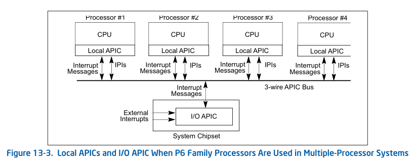
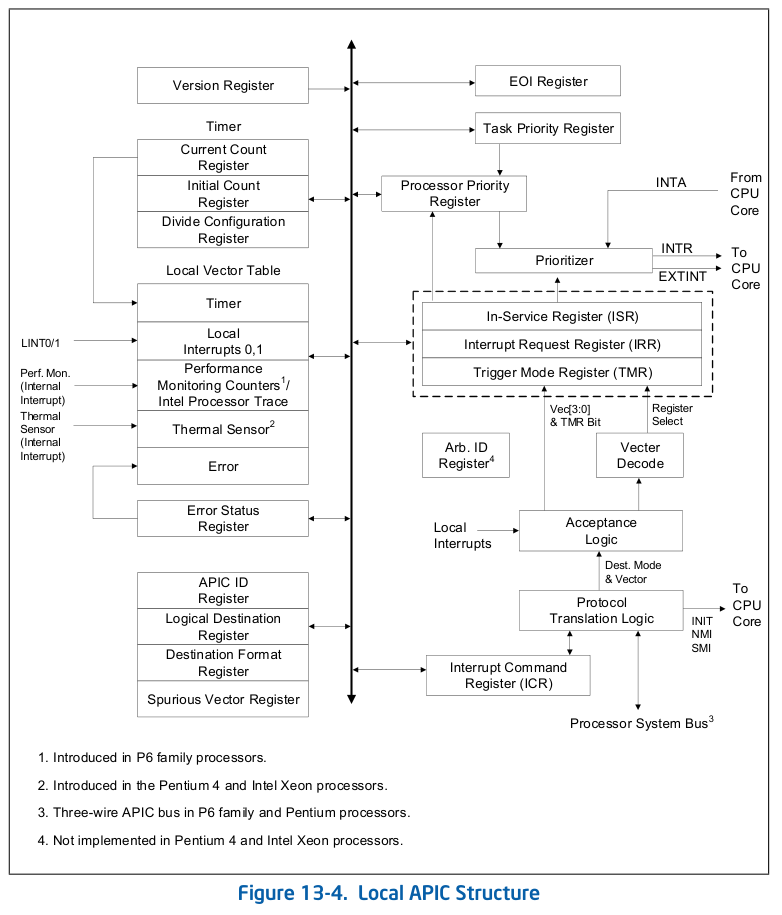
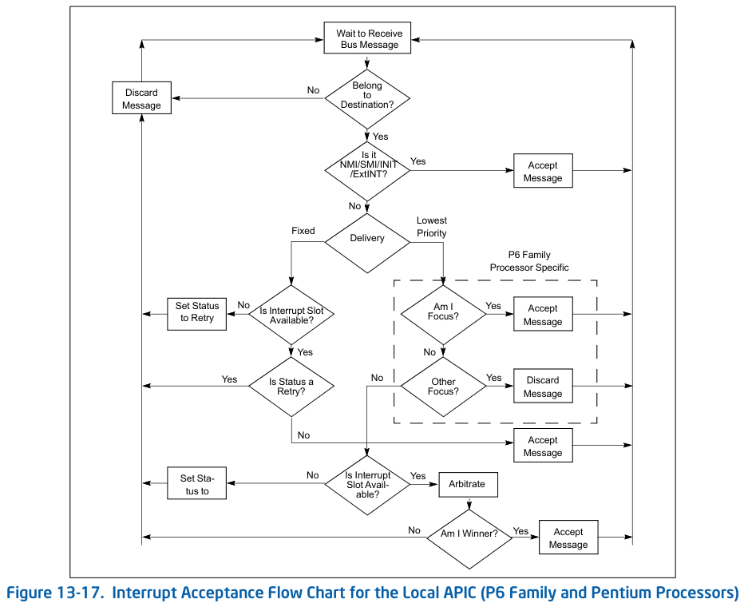
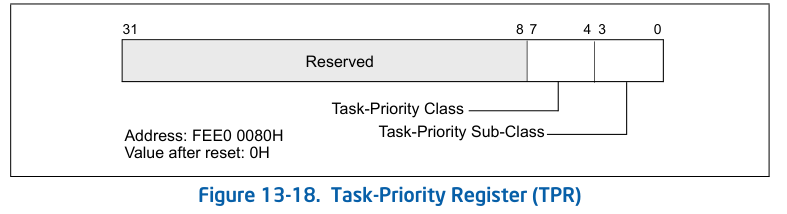
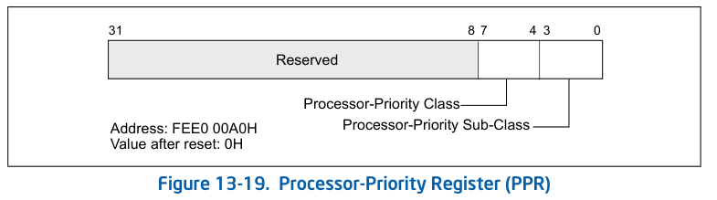
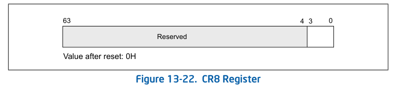
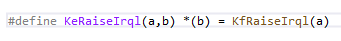

# WDM教程1：中断基础

::: tip 版权声明
本文版权归 [lee0xb1t](https://github.com/lee0xb1t) 所有，未经许可不得以任何形式转载。
:::

## 什么是IRQL？

IRQL是Windows抽象出的概念，用于管理硬件中断和软件中断优先级。

在进行Windows内核编程时，经常会遇到IRQL，如下所示：

```c
KIRQL OldIrql;
KeRaiseIrql(DISPATCH_LEVEL, &OldIrql);
// do something...
KeLowerIrql(OldIrql);
```

以上代码先提升当前IRQL，执行完必要操作后再降低IRQL。

IRQL有许多细节，为了理解这些，我们需要了解他的底层是如何实现的。

## APIC 和 I/O APIC

高级可编程中断控制器（Advanced Programmable Interrupt Controller, APIC）是 Intel 处理器的内置组件，用于接收和汇聚外部中断和I/O APIC的消息，并按照**优先级**提交转发给CPU**核心**。

他有两个核心职责：

1. 汇聚和转发中断

   将来自 LINT0/1 引脚、内部定时器/传感器、以及 I/O APIC 消息 的所有中断请求统一收集，按优先级提交给 CPU 核心。

2. 处理器间中断

   允许一个 CPU 核心向其他核心（或自身）发送中断消息。

I/O APIC位于南桥芯片组内，负责连接外部硬件（如键盘、硬盘、网卡、USB 控制器等），将这些设备的引脚电平信号转换为中断信号。

---



上图可以看到，External Interrupts（外部中断）由 System Chipset（系统芯片组）的 I/O APIC，将中断消息通过 Apic Bus（Apic总线）发送给 Local APIC（本地APIC）。

## Local APIC



由上图可知，诸如 Timer（定时器）、性能监控（如温度传感器等），已经集成到了Local APIC，也就说这些中断不由 I/O APIC 发送。

这些中断可以通过指定寄存器的向量编号（也就是 IDT 表的编号）和触发模式等进行编程。

## 中断接受

当一个本地中断被发送至处理器核心时，它需要经过下图的中断接受流程图中所规定的接受条件筛选。如果该中断被接受，它将被记录到 IRR（中断请求寄存器）中，并由处理器根据其优先级进行处理。如果该中断未被接受，它将被退回至本地 APIC 并重试。



上图是中断接受的流程图：

1. 等待 Apic总线消息
2. 属于哪个目标（中断号）
3. 是否是特殊中断（NMI、SMI、INIT、ExtINT）
4. 如果是特殊中断：直接发送处理器，不论处理器是否正在处理任务
5. 如果不是特殊中断：投递
6. 如果正在服务一个高优先级中断（ISR 非空且其向量优先级类 ≥ 新中断），则新中断可能被推迟。
7. ...

接受后的处理：

* 记录到 IRR：APIC 在 中断请求寄存器 (IRR) 中置位对应的向量位。此时中断处于待处理 (Pending) 状态。
* 等待调度：APIC 会不断扫描 IRR 和 ISR，结合 PPR 进行优先级裁决。当该中断成为当前最高优先级待处理中断且满足优先级条件时，它将被移至 ISR 并递交 CPU 执行。

## 处理器优先级

Local APIC 投递给处理器的每个中断，都具有基于其向量号的优先级。Local APIC 利用该优先级和其他处理器正在服务的中断优先级，来确定如何服务该中断。

每个中断向量均为一个8位值。**interrupt-priority class（中断优先级类）** 即中断向量第7至4位的值。最低的中断优先级类为1，最高为15；向量范围在 0–15 内（其中断优先级类为 0）的中断属于非法中断，永远不会被递送。

## 任务优先级

Local APIC 还定义了一个**任务优先级**和一个**处理器优先级**，用以决定中断的处理顺序。**task-priority class（任务优先级类）** 是任务优先级寄存器 (TPR) 第7至4位的值，该寄存器可由软件写入（TPR 是一个读/写寄存器）。如下图所示：



任务优先级允许软件为中断处理器设置一个**优先级阈值**。该机制使操作系统能够暂时阻止低优先级中断打扰处理器正在执行的高优先级工作。利用任务优先级阻塞此类中断的能力，源于TPR对**处理器优先级寄存器 (PPR)** 值的控制方式。

处理器优先级类是一个范围在0–15的值，维护在处理器优先级寄存器 (PPR) 的第7至4位中。PPR是一个**只读**寄存器。如下图所示：



## CR8

在 IA-32e(x64) 模式下，操作系统可以利用 **任务优先级寄存器(TPR)** 显式地管理16个中断优先级类（参见：处理器优先级）。操作系统可以通过 TPR 临时阻止特定（低优先级）中断打扰高优先级任务。具体做法是向 TPR 加载一个值，使其任务优先级类对应于希望被屏蔽的最高中断优先级类。

向 TPR 加载任务优先级类**8**(01000B)，将屏蔽所有优先级类 **≤ 8** 的中断，同时允许所有优先级类 **≥ 9** 的中断被识别。

向 TPR 加载任务优先级类0，将**启用所有**外部中断。

向 TPR 加载任务优先级类0FH (01111B，即15)，将**禁用所有**外部中断。

TPR（如图 13-18 所示）在复位时被清零为0。在64位模式下，软件可以通过一个**替代接口：MOV CR8 指令来读写 TPR**。当 MOV CR8 指令执行完成时，新的任务优先级类即被建立。软件在通过 MOV CR8 加载 TPR 后无需强制串行化。



## KfRaiseIrql

好了，现在让我们回到第一个问题（前面讲了一大堆都是为了这一节做铺垫）。

KeRaiseIrql 的定义如下所示：



而 KfRaiseIrql 的实现如下（来自 [reactos](https://github.com/reactos/reactos/blob/61fb4db34c6cb8d97ab65feab8fb264e59079bc1/sdk/include/xdk/amd64/ke.h#L92)）：

```c
_IRQL_requires_max_(HIGH_LEVEL)
_IRQL_raises_(NewIrql)
_IRQL_saves_
FORCEINLINE
KIRQL
KfRaiseIrql(
    _In_ KIRQL NewIrql)
{
    KIRQL OldIrql;

    OldIrql = (KIRQL)__readcr8();
    //ASSERT(OldIrql <= NewIrql);
    __writecr8(NewIrql);
    return OldIrql;
}
```

首先读取 cr8 并保存，接着写入新的cr8，结合之前的内容。我想读者已经知道了Irql的本质是什么。

```c
/* Interrupt request levels */
#define PASSIVE_LEVEL           0
#define LOW_LEVEL               0
#define APC_LEVEL               1
#define DISPATCH_LEVEL          2
#define CMCI_LEVEL              5
#define CLOCK_LEVEL             13
#define IPI_LEVEL               14
#define DRS_LEVEL               14
#define POWER_LEVEL             14
#define PROFILE_LEVEL           15
#define HIGH_LEVEL              15
```

Windows IRQL 数值直接等于 CR8 写入值，也等于 APIC 任务优先级类。这种 1:1:1 的线性映射就是中断优先级在 Windows 内核上的设计。

提升 IRQL 到 DISPATCH_LEVEL (2)，意味着 CR8 写入 2，APIC 将**屏蔽所有向量高 4 位 ≤ 2 的中断**。这确保了驱动程序的 DPC 例程不会被同级或低优先级中断打扰。

当 IRQL 提升到 15，CR8 = 15，APIC TPR 类 = 15。根据规则 **向量类 > 15** 才可响应，而**不存在**向量类 16 的普通中断，因此**所有可屏蔽中断全部被硬件屏蔽**。

注意：CR8 是每个核心私有的寄存器，写 CR8 修改当前核的 TPR。所以线程切到哪个核上跑，那个核的中断门槛就跟着线程走。

## 结尾

如果读者想要了解更多关于 APIC 相关的内容，可以阅读 Intel 软件开发手册（Intel SDM）第3卷第13章。
