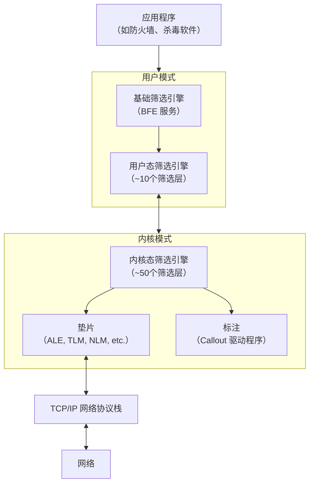
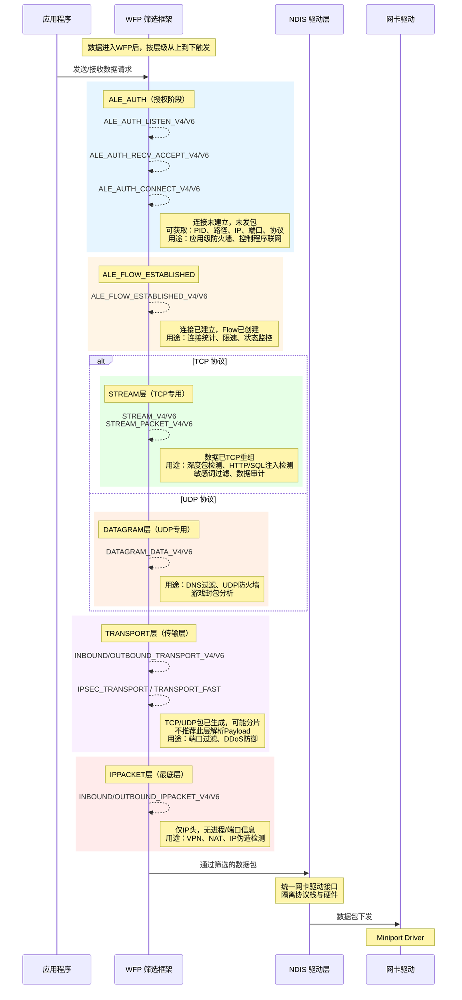
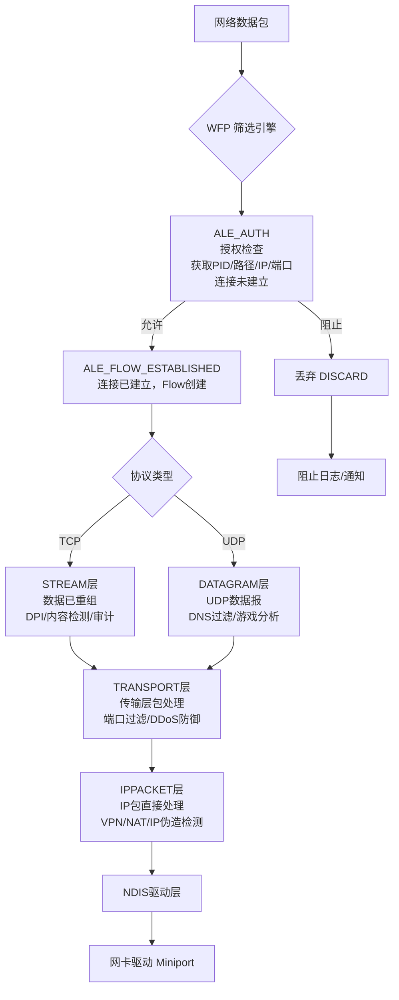

# WFP 过滤驱动01：基础

Windows 筛选平台（Windows Filtering Platform）是一套系统服务和 API，为软件提供了深入检查、修改和监控网络流量的能力。

## WFP 架构

WFP 架构是分层的，跨越了**用户态和内核态（框架为用户态和内核态提供了相关api）**。通过为不同层级安插**钩子（Hook）**，让软件能够深度介入网络流程。

<!-- markdownlint-disable MD033 -->

### 基础筛选引擎 (BFE)

基础筛选引擎位于用户态，运行在 svchost.exe 中的服务（bfe.dll），负责接收来自软件的规则、执行安全内置模型（如权限验证），并将规则下发至筛选引擎。

### 垫片 (Shims)

垫片(Shims)位于内核态，由WFP筛选引擎实现。作为 WFP 筛选引擎在协议栈各层安插的内核模块，负责解析原始数据包，将其属性（如 IP、端口）暴露给筛选引擎，并执行引擎返回的裁决结果（如阻止、准许）。

### 标注 (Callouts)

标注(Callouts)位于内核态，由第三方驱动程序提供的回调函数。当筛选引擎匹配到特定规则时，可触发对应标注，以执行深度内容检查（如病毒扫描）、数据修改等复杂操作。

## WFP 触发层级

WFP 已经抽象出了每个层级

### 时序图

### 流程图

::: note 还有许多其他的层级，有兴趣可以自行了解
FWPM_LAYER_INGRESS_VSWITCH_TRANSPORT_V4：进入虚拟交换机的 IPv4 transport packet
FWPM_LAYER_INGRESS_VSWITCH_TRANSPORT_V6：与 V4 相同
FWPM_LAYER_EGRESS_VSWITCH_TRANSPORT_V4：离开虚拟交换机的 IPv4 transport packet
FWPM_LAYER_EGRESS_VSWITCH_TRANSPORT_V6：与 V4 相同
FWPM_LAYER_INBOUND_TRANSPORT_FAST：高速 inbound packet path
FWPM_LAYER_OUTBOUND_TRANSPORT_FAST：高速 outbound path
FWPM_CALLOUT_IPSEC_INBOUND_TRANSPORT_V4：IPSec inbound transport packet
FWPM_CALLOUT_IPSEC_INBOUND_TRANSPORT_V6：与 V4 相同
FWPM_CALLOUT_IPSEC_OUTBOUND_TRANSPORT_V4：IPSec outbound encrypt
FWPM_CALLOUT_IPSEC_OUTBOUND_TRANSPORT_V6：与 V4 相同
FWPM_CALLOUT_WFP_TRANSPORT_LAYER_V4_SILENT_DROP：静默丢弃 IPv4 transport packet
FWPM_CALLOUT_WFP_TRANSPORT_LAYER_V6_SILENT_DROP：与 V4 相同
:::

## FlowContext

`FlowContext`由驱动代码显式创建，一般在**ALE_FLOW_ESTABLISHED**层通过`FwpsFlowAssociateContext`关联到自定义类型。**ALE**各层可以获取进程ID等信息，供后层使用。

`FlowContext`必须通过`flowDeleteFn`回调函数删除，避免内存泄漏。

::: warning 经过实验FlowContext只能在`STREAM层`和`DATAGRAM层`使用
`Transport层`和`IPPACK层`无法使用
:::

## 流量转发

### TCP 流量转发

TCP 流量转发比较好的方案是转发连接，在`FWPM_LAYER_ALE_AUTH_CONNECT_V4/V6`层实现，代码可以参考[lee0xb1t/leaf](https://github.com/lee0xb1t/leaf)。

### UDP 流量转发

UDP 流量转发微软官方demo通过在`FWPM_LAYER_DATAGRAM_DATA_V4/V6`层修改 UDP 数据包目标地址实现，代码可以参考[ddproxy](https://github.com/microsoft/windows-driver-samples/tree/main/network/trans/ddproxy)。
